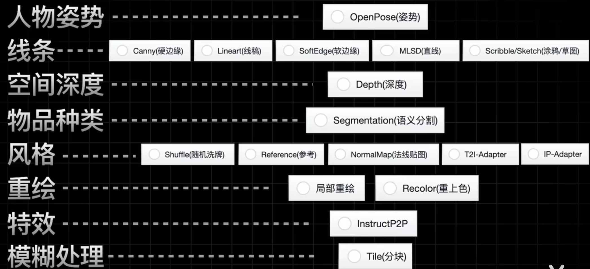

# ControlNet

## 安装

### 安装 ControlNet 插件

需要将 ControlNet 插件放置在 `extensions` 目录下

下载地址: [https://github.com/Mikubill/sd-webui-controlnet](https://github.com/Mikubill/sd-webui-controlnet)

```bash
# 定位到 SD web 下 extensions 目录
# NOTICE: $SD_WEB_UI_ROOT: 为 `stable-diffusion-webui` 项目路径
cd $SD_WEB_UI_ROOT/extensions

# 下载安装 ControlNet 插件
git clone https://github.com/Mikubill/sd-webui-controlnet
```

### ControlNet 模型下载

下载地址: [https://huggingface.co/lllyasviel/ControlNet-v1-1/tree/main](https://huggingface.co/lllyasviel/ControlNet-v1-1/tree/main)

**ControlNet 类别**:


