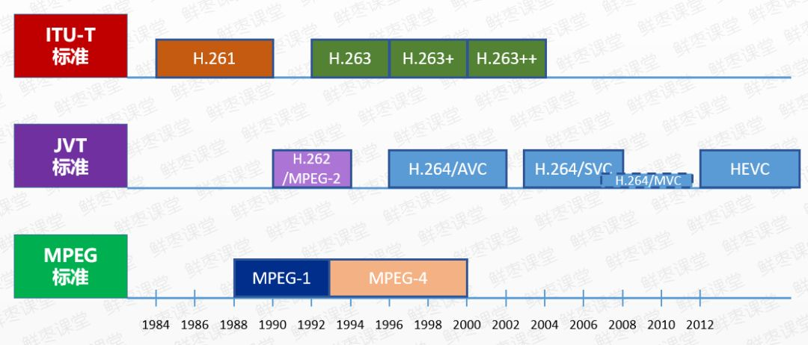
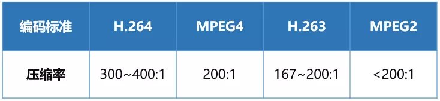
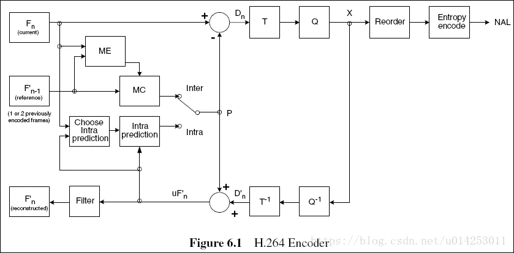
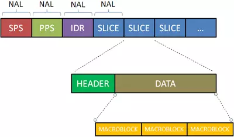
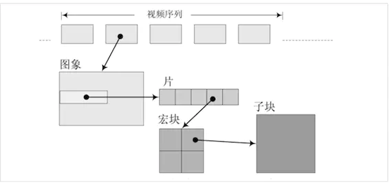
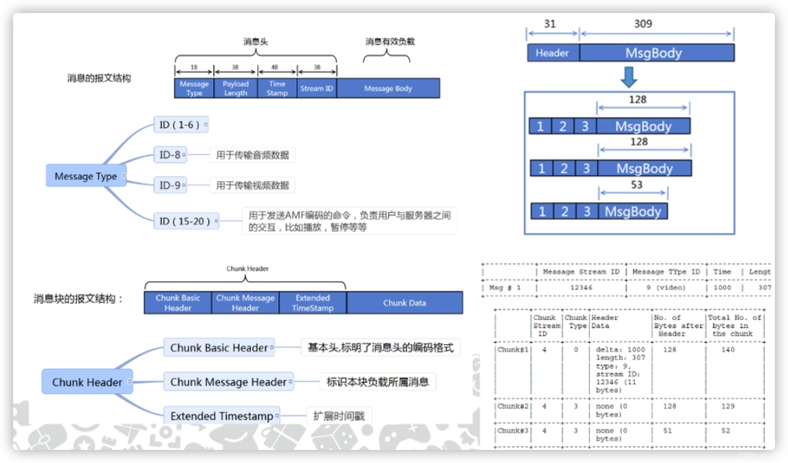

# 视频传输过程

## 基础概念

视频是由一张张图片快速切换构成的

**帧 (Frame)**: 指一幅静止的画面, 即一张图片.

**帧率 (Frame Rate)**: 指视频每秒钟包括的画面数量（FPS，Frame per second）, 帧率越高，视频就越逼真、观看越流畅.

Q: 一个视频，如果未经编码，它的体积是非常庞大的.

以一个分辨率 1920×1280，帧率 30 的视频为例。

> 1920×1280=2,073,600（Pixels 像素）
>
> 每个像素点是 24bit = 4×8bit
>
> 也就是每幅图片 2073600×24 = 49766400bit = 6220800byte ≈ 6.22MB
>
> 这是一幅 1920×1280 图片的原始大小，再乘以帧率 30，也就是说，每秒视频的大小是 186.6MB，每分钟大约是 11GB，一部 90 分钟的电影，约是 1000GB...

## 视频的编码压缩

视频编码标准的发展关系



视频编码组织关系


视频编码压缩率



H264 编码器原理图



NAL 格式





```txt

1帧 = n个片
1片 = n个宏块
1宏块 = 16x16yuv数据

```

RTMP 协议



Message Body 就是一个 NAL.

## 参考

- [视频的编码与传输过程](https://blog.csdn.net/qq_45283176/article/details/116761254)
- [H264 基本原理](https://zhuanlan.zhihu.com/p/31056455)
- [RTMP 推流与 B 帧的关系](https://www.cnblogs.com/doudouyoutang/p/9454393.html)
- [NALU 格式](https://www.jianshu.com/p/1b3f8187b271)
- [H264 之 NALU 解析](https://zhuanlan.zhihu.com/p/409527359)
- [rtmp 协议详解](https://www.cnblogs.com/jimodetiantang/p/8974075.html)
- [RTMP FLV H.264 NALU GOP](https://blog.csdn.net/qq_27074387/article/details/123036593)
