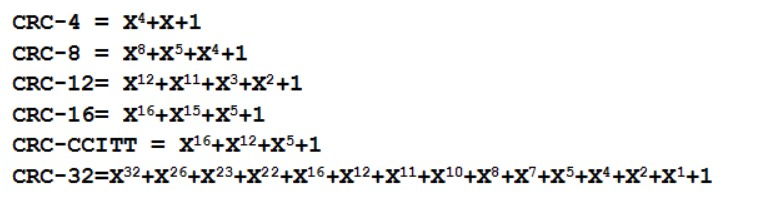
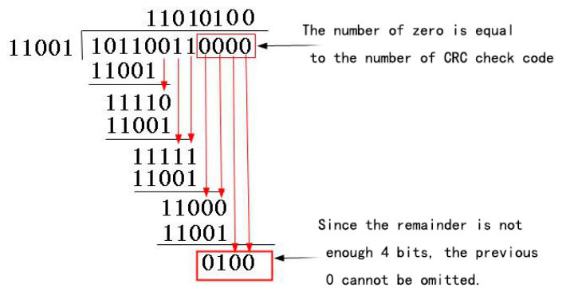

# 循环冗余校验

## CRC 表达式

## CRC-4 示例

以 $G(X)=X^4 + X^3 + 1$ 为例，设原数据为 `10110011`。

1. $G(X)=X^4 + X^3 + 1$, 二进制比特串为 `11001`。（在 X 的 n 次方不为 0 处 2 的 n 次方的位=1 )

2. 因为校验码 4 位，所以 `10110011` 后面需加 4 个 0，得到 `101100110000`，用“模 2 除法” (即逻辑亦或^) 即可得出结果：

   

3. 即 CRC^101100110000 得到 `101100110100`，并发送到接收端。

4. 接收端收到 `101100110100` 后除以 11001(以“模 2 除法”方式去除),余数为 `0` 则无差错。
