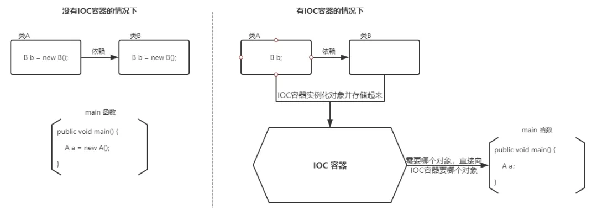

# IOC

## 什么是IOC

IOC(Inversion of control): 控制反转, 描述的是：Java 开发领域对象的创建以及管理的问题。

例如：现有类 A 依赖于类 B

> **传统的开发方式** ：往往是在类 A 中手动通过 new 关键字来 new 一个 B 的对象出来
> **使用 IoC 思想的开发方式** ：不通过 new 关键字来创建对象，而是通过 IoC 容器(Spring 框架) 来帮助我们实例化对象。我们需要哪个对象，直接从 IoC 容器里面过去即可。

### 为什么叫控制反转

`控制`：指的是对象创建（实例化、管理）的权力

`反转`：控制权交给外部环境（Spring 框架、IoC 容器）

### IoC 解决了什么问题

IoC 的思想就是两方之间不互相依赖，由第三方容器来管理相关资源。这样有什么好处呢？

1. 对象之间的耦合度或者说依赖程度降低；
2. 资源变的容易管理；比如你用 Spring 容器提供的话很容易就可以实现一个单例。

**需要解决的核心问题**:

1. 谁负责创建组件？
2. 谁负责根据依赖关系组装组件？
3. 销毁时，如何按依赖顺序正确销毁？

## 参考

[IoC 和 AOP](https://mp.weixin.qq.com/s?__biz=Mzg2OTA0Njk0OA==&mid=2247486938&idx=1&sn=c99ef0233f39a5ffc1b98c81e02dfcd4&chksm=cea24211f9d5cb07fa901183ba4d96187820713a72387788408040822ffb2ed575d28e953ce7&token=1736772241&lang=zh_CN#rd)
