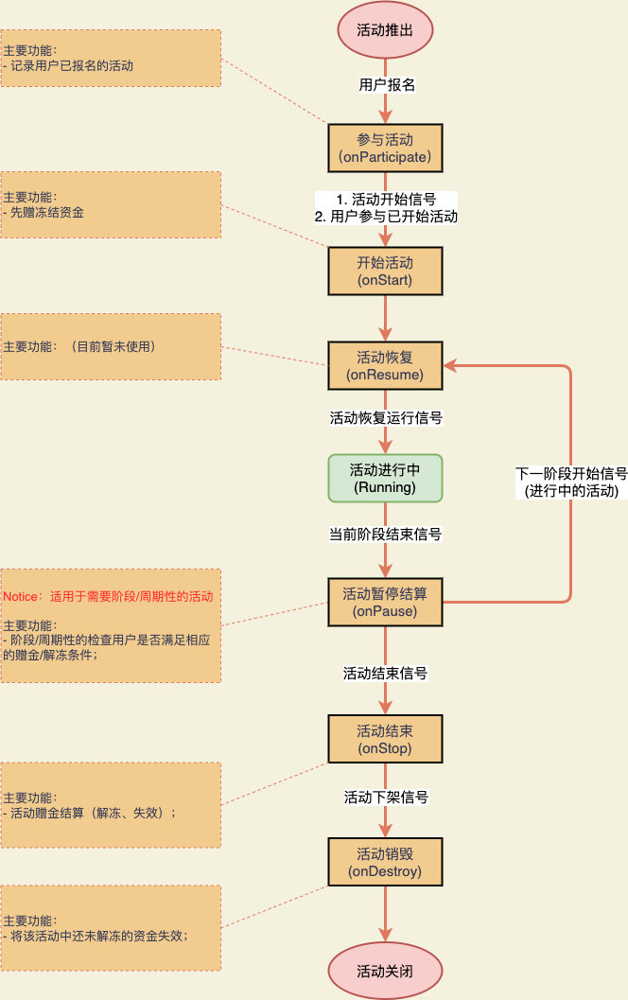

# 活动运营中心的设计

Date: 2022-04-15

## 需求

大致分两类需求:

1. 长期活动;
2. **限期活动**.

**长期活动功能已存在, 暂时先跳过**, 这里主要描述下**限期活动**的需求.

系统现状: 存在赠金账户, 用户参与了活动后, 如果满足条件的话, 就需要给用户赠金; 赠金分为冻结资金和可以使用的资金.

用户赠金的操作大致可以分为两类:

- 满足条件, 后赠金(大部分是非冻结资金);
- 先赠冻结的资金, 满足条件后再解冻.

## 设计部分

### 活动的状态流转图

**活动状态**:

| 状态码 | 是否可报名(默认) | 描述           |
| ------ | ---------------- | -------------- |
| 0      | false            | 未上架         |
| 1      | true             | 已上架, 未开始 |
| 2      | true             | 活动进行中     |
| 5      | false            | 活动已暂停     |
| 8      | false            | 已结束         |
| 9      | false            | 已下架         |

状态流转图

`至活动开始时间` 和 `至活动结束时间` 事件需要定时器进行触发, 其余的都依靠运营人员对活动进行管理进而触发.

### 用户任务的生命周期

