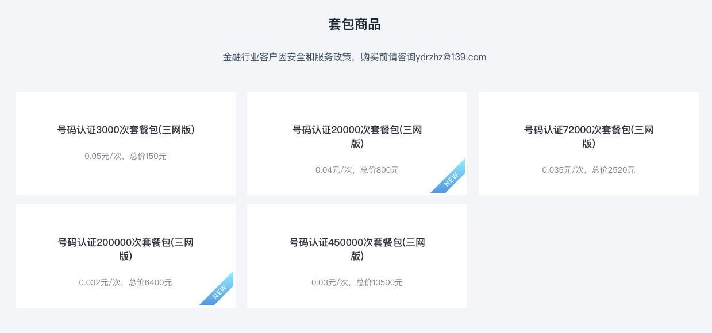
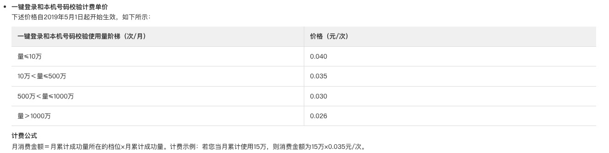
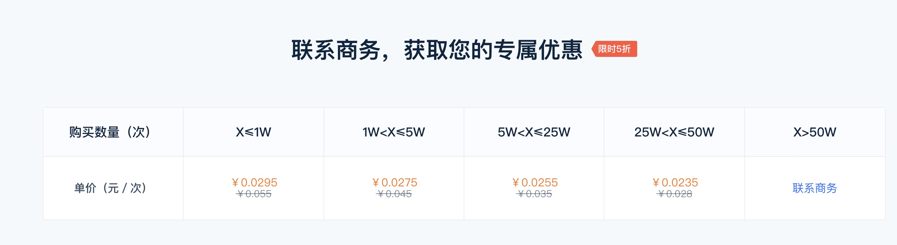
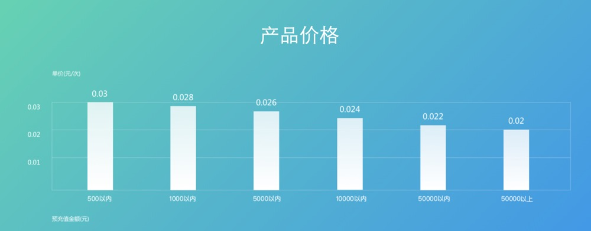

# 一键登录功能

## 取号流程

### 1. SDK 初始化

调用 SDK 的初始化方法，传入项目在平台上的 AppKey 和 AppSecret。

### 2. 唤起授权页

调用 SDK 唤起授权接口。SDK 会先向运营商发起获取手机号掩码的请求，请求成功后跳转到授权页。授权页会显示手机号掩码以及运营商协议给用户确认。

### 3. 同意授权并登录

用户同意相关协议，点击授权页面的登录按钮，SDK 会请求本次取号的 token，请求成功后将 token 返回给客户端。

### 4. 取号

将获取到的 token 发送到我们自己的服务器，由服务器携带 token 调用运营商一键登录的接口，调用成功就返回手机号码了。服务器用手机号进行登录或注册操作，返回操作结果给客户端，完成一键登录。

## 网络

在认证过程中，会把网络切换为移动蜂窝网络，目前支持的制式有中国移动 2G/3G/4G、中国联通 3G/4G、中国电信 4G。当然最好是使用 4G，使用 2G、3G 会降低认证的成功率。

在没有插电话卡，或者关闭移动蜂窝网络的情况下，是无法完成认证的。所以就算接入了一键登录，我们也要兼容传统的登录方式，允许用户在认证失败的情况下，手动输入手机号登录。

## 三大运营商 一键登录

更方便、快捷地完成注册、登录流程，将原本可能需要 20 秒的流程，缩短到了 2 秒左右，很大程度上降低了登录环节的用户流失。

- [移动 - 互联网能力开放平台](http://dev.10086.cn/)

套餐费用:

- [电信 - 天翼账号开放平台](https://id.189.cn/)

费用: 0.1 元/次

- [联通 - WO+ 开放平台](http://open.wo.com.cn/)

升级中...

## 三大运营商兼容

- [阿里 - 号码认证服务](https://help.aliyun.com/product/75010.html)

套餐费用:

- [创蓝 - 闪验](http://flash.253.com)

- [极光 - 极光认证](https://www.jiguang.cn/identify)

套餐费用:

- [mob - 秒验](http://www.mob.com/mobService/secverify)

套餐费用:

- uniapp 一键登录

费用:

## 参考

- [一键登录](https://www.jianshu.com/p/52895f9cb933)
- [uni 一键登录](https://uniapp.dcloud.io/univerify.html)
