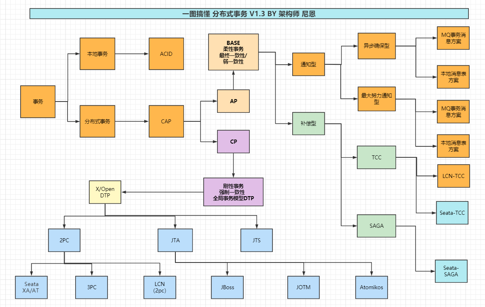
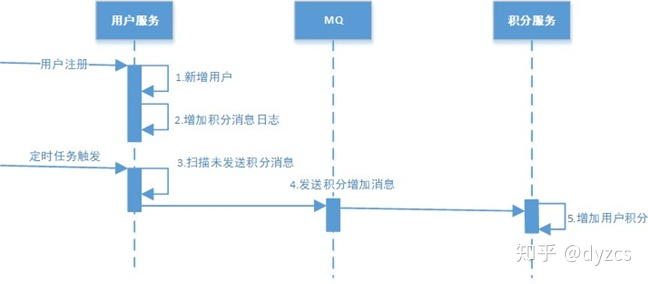
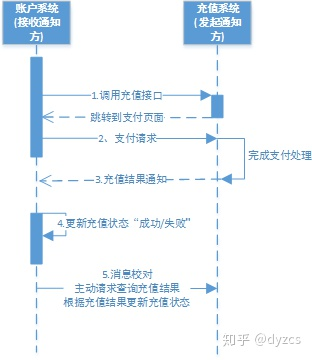

# 分布式事务

## DTP

### 2PC

### 3PC

<!-- ### TCC -->

## BASE

### 可靠消息服务方案

#### 本地消息表方案

### 最大努力通知方案

## 参考

[分布式事务](https://zhuanlan.zhihu.com/p/263555694)
[分布式事务的 4 种模式](https://zhuanlan.zhihu.com/p/78599954)
[Seata 入门教程 - 基础篇](https://www.techgrow.cn/posts/e8b71fbe.html)
[分布式系统](https://www.cnblogs.com/crazymakercircle/p/13917517.html)

Seata 实现 2PC 与传统 2PC 的差别:
[2PC（两阶段提交）【XA 与 Seata 方案】](https://www.cnblogs.com/zhengzhaoxiang/p/13976527.html)
