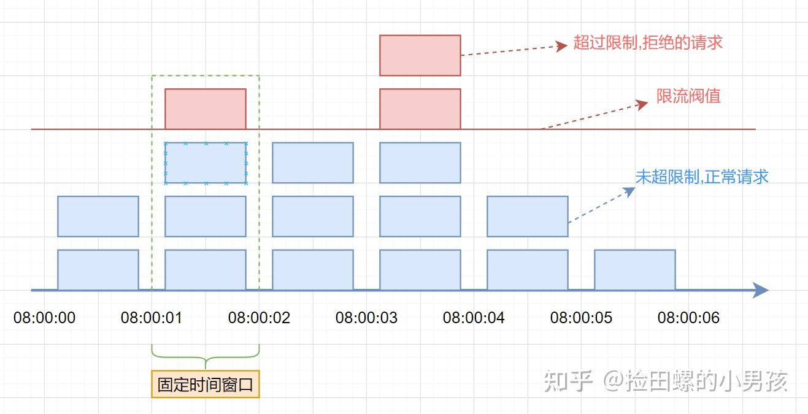
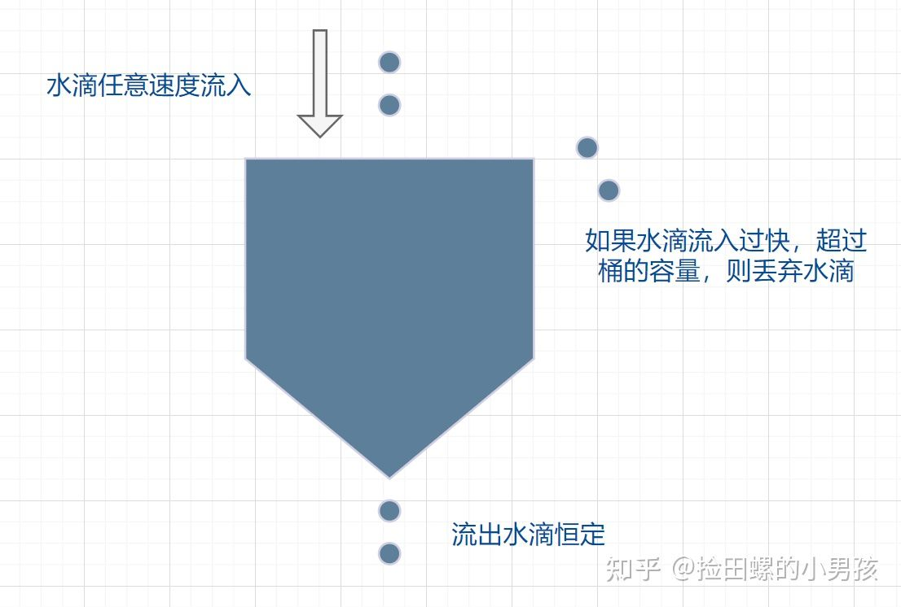
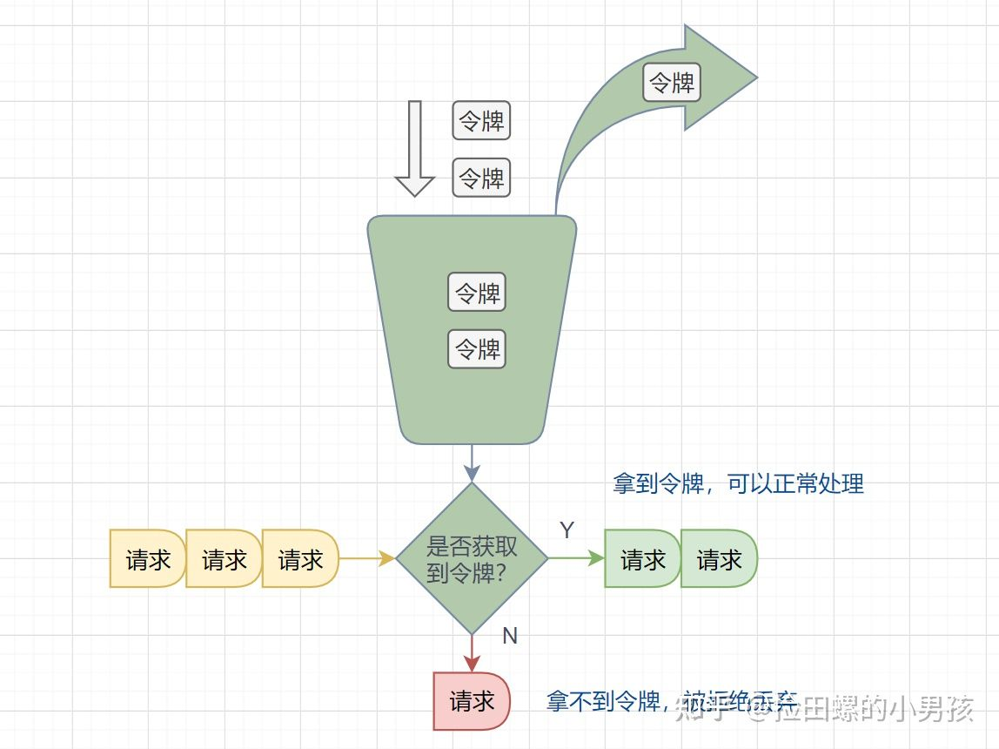

# 限流算法

限流，也称流量控制。是指系统在面临高并发，或者大流量请求的情况下，限制新的请求对系统的访问，从而保证系统的稳定性

## 固定窗口限流算法

```text
假设单位时间是1秒，限流阀值为3。
在单位时间1秒内，每来一个请求,计数器就加1，如果计数器累加的次数超过限流阀值3，后续的请求全部拒绝。
等到1s结束后，计数器清0，重新开始计数。
```



**临界问题**：假设限流阀值为 5 个请求，单位时间窗口是 1s,如果我们在单位时间内的前 0.8-1s 和 1-1.2s，分别并发 5 个请求。虽然都没有超过阀值，但是如果算 0.8-1.2s,则并发数高达 10，已经超过单位时间 1s 不超过 5 阀值的定义啦。

## 滑动时间窗口算法

```text
假设单位时间还是1s，滑动窗口算法把它划分为5个小周期，也就是滑动窗口（单位时间）被划分为5个小格子。
每格表示0.2s。每过0.2s，时间窗口就会往右滑动一格。
然后呢，每个小周期，都有自己独立的计数器，如果请求是0.83s到达的，0.8~1.0s对应的计数器就会加1。
```


## 漏桶限速算法

漏桶算法面对限流，就更加的柔性，不存在直接的粗暴拒绝。



## 令牌桶限流算法

**令牌桶算法原理**：

- 有一个令牌管理员，根据限流大小，定速往令牌桶里放令牌。
- 如果令牌数量满了，超过令牌桶容量的限制，那就丢弃。
- 系统在接受到一个用户请求时，都会先去令牌桶要一个令牌。如果拿到令牌，那么就处理这个请求的业务逻辑；
- 如果拿不到令牌，就直接拒绝这个请求。



## 参考

[4 种经典限流算法讲解](https://zhuanlan.zhihu.com/p/376564740)
