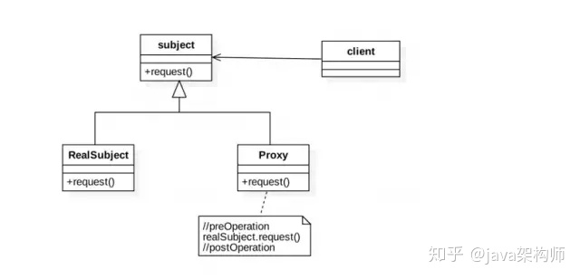
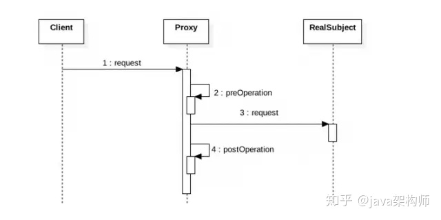

# AOP

## 什么是AOP

AOP(Aspect oriented programming)：面向切面编程。

### AOP 解决了什么问题

AOP 主要用来解决：在不改变原有业务逻辑的情况下，增强横切逻辑代码，根本上解耦合，避免横切逻辑代码重复。

## 实现原理

代理模式包含如下角色:
> `subject`: 抽象主题角色，是一个接口。该接口是对象和它的代理共用的接口;
>
> `RealSubject`: 真实主题角色，是实现抽象主题接口的类;
>
> `Proxy`: 代理角色，内部含有对真实对象RealSubject的引用，从而可以操作真实对象。





### 静态代理

创建一个Person接口.

```java
/**
 * 创建person接口
 */
public interface Person {
    //交作业
    void giveTask();
}
```

Student类实现Person接口，Student可以具体实施交作业这个行为

```java
public class Student implements Person {
    private String name;
    public Student(String name) {
        this.name = name;
    }

    public void giveTask() {
        System.out.println(name + "交语文作业");
    }
}
```

StudentsProxy类，这个类也实现了Person接口，但是还另外持有一个学生类对象，那么他可以代理学生类对象执行交作业的行为。

```java
/**
 * 学生代理类，也实现了Person接口，保存一个学生实体，这样就可以代理学生产生行为
 */
public class StudentsProxy implements Person{
    //被代理的学生
    Student stu;

    public StudentsProxy(Person stu) {
        // 只代理学生对象
        if(stu.getClass() == Student.class) {
            this.stu = (Student)stu;
        }
    }

    //代理交作业，调用被代理学生的交作业的行为
    public void giveTask() {
        stu.giveTask();
    }
}
```

测试一下，看代理模式如何使用：

```java
public class StaticProxyTest {
    public static void main(String[] args) {
        //被代理的学生林浅，他的作业上交有代理对象monitor完成
        Person linqian = new Student("林浅");

        //生成代理对象，并将林浅传给代理对象
        Person monitor = new StudentsProxy(linqian);

        //班长代理交作业
        monitor.giveTask();
    }
}
```

### 动态代理

动态代理和静态代理的区别是，静态代理的的代理类是我们自己定义好的，在程序运行之前就已经变异完成，但是动态代理的代理类是在程序运行时创建的。

相比于静态代理，动态代理的优势在于可以很方便的对代理类的函数进行统一的处理，而不用修改每个代理类中的方法。比如我们想在每个代理方法之前都加一个处理方法，我们上面的例子中只有一个代理方法，如果还有很多的代理方法，就太麻烦了.

首先还是定义一个Person接口:

```java
/**
 * 创建person接口
 */
public interface Person {
    //交作业
    void giveTask();
}
```

创建需要被代理的实际类，也就是学生类：

```java
public class Student implements Person {
    private String name;
    public Student(String name) {
        this.name = name;
    }

    public void giveTask() {
        System.out.println(name + "交语文作业");
    }
}
```

创建 `StuInvocationHandler` 类，实现 `InvocationHandler` 接口，这个类中持有一个被代理对象的实例 `target` 。 `InvocationHandler` 中有一个 `invoke` 方法，所有执行代理对象的方法都会被替换成执行 `invoke` 方法。

```java
public class StuInvocationHandler<T> implements InvocationHandler {
    //invocationHandler持有的被代理对象
    T target;

    public StuInvocationHandler(T target) {
        this.target = target;
    }

    /**
     * proxy:代表动态代理对象
     * method：代表正在执行的方法
     * args：代表调用目标方法时传入的实参
     */
    public Object invoke(Object proxy, Method method, Object[] args) throws Throwable {
        System.out.println("代理执行" +method.getName() + "方法");
        Object result = method.invoke(target, args);
        return result;
    }
}
```

创建代理对象

```java
/**
 * 代理类
 */
public class ProxyTest {
    public static void main(String[] args) {

        // 创建一个实例对象，这个对象是被代理的对象
        Person linqian = new Student("林浅");

        // 创建一个与代理对象相关联的InvocationHandler
        InvocationHandler stuHandler = new StuInvocationHandler<Person>(linqian);

        // 创建一个代理对象stuProxy来代理linqian，代理对象的每个执行方法都会替换执行Invocation中的invoke方法
        Person stuProxy = (Person) Proxy.newProxyInstance(Person.class.getClassLoader(), new Class<?>[]{Person.class}, stuHandler);

        // 代理执行交作业的方法
        stuProxy.giveTask();
    }
}
```

首先我们创建了一个需要被代理的学生林浅，将林浅传入stuHandler中，我们在创建代理对象stuProxy时，将stuHandler作为参数，那么所有执行代理对象的方法都会被替换成执行invoke方法，也就是说，最后执行的是StuInvocationHandler中的invoke方法。

## 参考

[由浅入深揭开 AOP 实现原理](https://zhuanlan.zhihu.com/p/93135819)