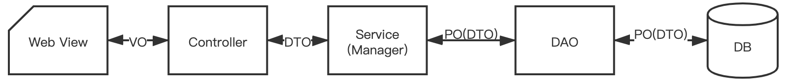

# POJO

## POJO 介绍

专指只有setter/getter/toString的简单类，包括DO/DTO/BO/VO等。

POJO是DO/DTO/BO/VO的统称.

### PO（Persistent Object）= DO（Data Object）

持久化对象，它跟持久层（通常是关系型数据库）的数据结构形成一一对应的映射关系，如果持久层是关系型数据库，那么，数据表中的每个字段（或若干个）就对应PO的一个（或若干个）属性。通过 DAO 层向上传输数据源对象。

### VO(View Object)

视图对象，用于展示层，它的作用是把某个指定页面（或组件）的所有数据封装起来。

简单理解为页面展示用的数据。

### DTO（Data Transfer Object）

数据传输对象，Service或Manager向外传输的对象。这个概念来源于J2EE的设计模式，原来的目的是为了EJB的分布式应用提供粗粒度的数据实体，以减少分布式调用的次数，从而提高分布式调用的性能和降低网络负载，但在这里，我泛指用于展示层与服务层之间的数据传输对象。

简单理解，例如一张数据库表有50个字段，那么PO就有50个属性，但是我们在远程服务或者页面显示只需要10个字段。这时就没有必要传输所有的字段，而是用10个属性的DTO来进行传递。

### BO（ Business Object）

业务对象。 由Service层内封装的临时业务逻辑的对象。通过调用 DAO 方法 , 结合 PO、VO 进行业务操作。 一个BO对象可以包括多个PO对象。如常见的工作简历例子为例，简历可以理解为一个BO，简历又包括工作经历，学习经历等，这些可以理解为一个个的PO，由多个PO组成BO。复杂例子PO1是交易记录，PO2是登录记录，PO3是商品浏览记录，PO4是添加购物车记录，PO5是搜索记录，BO是个人网站行为对象。

BO是一个业务对象，一类业务就会对应一个BO，数量上没有限制，而且BO会有很多业务操作，也就是说除了get，set方法以外，BO会有很多针对自身数据进行计算的方法。

现在很多持久层框架自身就提供了数据组合的功能，因此BO有可能是在业务层由业务来拼装PO而成，也有可能是在数据库访问层由框架直接生成。很多情况下为了追求查询的效率，框架跳过PO直接生成BO的情况非常普遍，PO只是用来增删改使用。（左边这句话，？，真的会这么做吗？）

## 应用总结

> **Controller层**: `public List<UserVO> getUsers(UserQuery userQuery)`。此层常见的转换为：DTO转VO
>
> **Query**: 数据查询对象，各层接收上层的查询请求。注意超过 2 个参数的查询封装，禁止使用 Map 类来传输。
>
> **Service/Manager层**: `List<UserDTO> getUsers(UserQuery userQuery)`。然后在Service内部使用UserBO封装中间所需的逻辑对象，此层常见的转换为：PO转DTO，或PO转BO转DTO
>
> **DAO层**: `List<UserPO> getUsers(UserQuery userQuery)`

## 区别

### VO和DTO

**区别**:

对于绝大部分的应用场景来说，DTO和VO的属性值基本是一致的，而且他们通常都是POJO，因此没必要多此一举，但不要忘记这是实现层面的思维，对于设计层面来说，概念上还是应该存在VO和DTO，因为两者有着本质的区别，DTO代表服务层需要接收的数据和返回的数据，而VO代表展示层需要显示的数据。

**应用**:

以下才场景中，可以考虑把VO与DTO二合为一（注意：是实现层面）：

- 当需求非常清晰稳定，而且客户端很明确只有一个的时候，没有必要把VO和DTO区分开来，这时候VO可以退隐，用一个DTO即可，为什么是VO退隐而不是DTO？回到设计层面，服务层的职责依然不应该与展示层耦合，所以，对于前面的例子，你很容易理解，DTO对于“性别”来说，依然不能用“帅哥美女”，这个转换应该依赖于页面的脚本（如JavaScript）或其他机制（JSTL、EL、CSS）

- 即使客户端可以进行定制，或者存在多个不同的客户端，如果客户端能够用某种技术（脚本或其他机制）实现转换，同样可以让VO退隐

以下场景需要优先考虑VO、DTO并存:

- 上述场景的反面场景

- 因为某种技术原因，比如某个框架（如Flex）提供自动把POJO转换为UI中某些Field时，可以考虑在实现层面定义出VO，这个权衡完全取决于使用框架的自动转换能力带来的开发和维护效率提升与设计多一个VO所多做的事情带来的开发和维护效率的下降之间的比对。

- 如果页面出现一个“大视图”，而组成这个大视图的所有数据需要调用多个服务，返回多个DTO来组装（当然，这同样可以通过服务层提供一次性返回一个大视图的DTO来取代，但在服务层提供一个这样的方法是否合适，需要在设计层面进行权衡）。

### BO和DTO

这两个的区别主要是就是字段的删减。

BO对内，为了进行业务计算需要辅助数据，或者是一个业务有多个对外的接口，BO可能会含有很多接口对外所不需要的数据，因此DTO需要在BO的基础上，只要自己需要的数据，然后对外提供。

在这个关系上，通常不会有数据内容的变化，内容变化要么在BO内部业务计算的时候完成，要么在解释VO的时候完成。

## 相关的代码规范

### 命名风格

【强制】类名使用 UpperCamelCase 风格，必须遵从驼峰形式，但以下情形例外:DO / BO /DTO / VO / AO

正例:MarcoPolo / UserDO / XmlService / TcpUdpDeal / TaPromotion

反例:macroPolo / UserDo / XMLService / TCPUDPDeal / TAPromotion

【参考】各层命名规约:

- A）Service/DAO层方法命名规约
  - 1) 获取单个对象的方法用`get`做前缀。
  - 2) 获取多个对象的方法用`list`做前缀。
  - 3) 获取统计值的方法用`count`做前缀。
  - 4) 插入的方法用`save/insert`做前缀。
  - 5) 删除的方法用`remove/delete`做前缀。
  - 6) 修改的方法用`update`做前缀。

- B）领域模型命名规约
  - 1) 数据对象:xxxDO，xxx即为数据表名。
  - 2) 数据传输对象:xxxDTO，xxx为业务领域相关的名称。
  - 3) 展示对象:xxxVO，xxx一般为网页名称。
  - 4) POJO是DO/DTO/BO/VO的统称，禁止命名成xxxPOJO。

### OOP 规约

【强制】定义 DO/DTO/VO 等 POJO 类时，不要设定任何属性默认值。
反例:POJO类的 addTime 默认值为new Date(); 但是这个属性在数据提取时并没有置入具体值，在更新其它字段时又附带更新了此字段，导致创建时间被修改成当前时间。

## 参考

[PO/DO/VO/DTO/BO/POJO的介绍](https://www.cnblogs.com/kuotian/p/15087104.html)