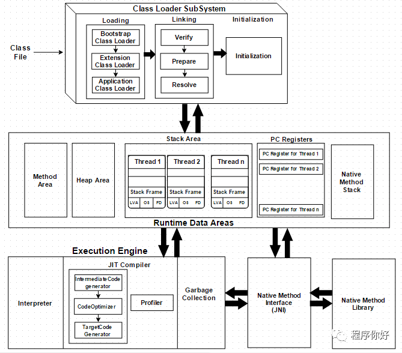

# JVM

## jvm体系架构

### 类加载器 & 双亲委派

**加载**
类将由该组件加载,BootStrap ClassLoader, Extension ClassLoader和 Application ClassLoader(应用程序类加载器)。

BootStrap ClassLoader – 负责从 bootstrap加载类，rt.jar。这个加载程序将获得最高优先级。
Extension ClassLoader – 负责加载ext文件夹中的类(jrelib).
Application ClassLoader – 负责加载应用程序级类路径、环境变量路径等。

### PC寄存器(程序计数器)

每个线程都有一个程序计数器，是线程私有的；就是一个指针，指向方法区中的方法字节码（用来存储指向下一条指令的地址，既将要执行的指令代码），由执行引擎读取下一条指令，是一个非常小的内存空间，几乎可以忽略不记；

### 栈

栈的运行原理：栈中的数据都是以栈帧(Stack Frame)的格式存在，栈帧是一个内存区块，是一个数据集，是一个有关方法（ Method ）和运行期数据的数据集，当一个方法A被调用时就产生了一个栈帧 Fl ，并被压入到栈中， A方法又调用了B方法，于是产生栈帧 F2 也被压入栈，B方法又调用了C方法，于是产生栈帧 F3 也被压入栈，执行完毕后，先弹出 F3 栈帧，再弹出 F2 栈帧，再弹出 Fl 栈帧 以此类推， 遵循“先进后出” / “后进先出”原则。

### 堆

是Java虚拟机管理内存中的最大一块；Java堆是所有线程共享的一块内存管理区域。此内存区域唯一目的就是存放对象的实例，几乎所有对象实例都在堆中分配内存。

#### 新生代 TODO

**伊甸区**
**from**
**to**

#### 老年代

#### 永久区

## GC

### 引用计数法

### 复制算法

### 标记压缩清除算法

### 总结

## JVM调优

## 参考

[狂神说Java】JVM快速入门篇](https://www.bilibili.com/video/BV1iJ411d7jS)
