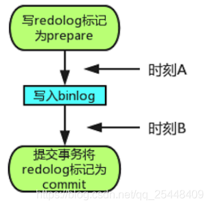

# ACID 靠什么保证

## A: 原子性

> 利用InnoDB的undo log
> undo log（回滚日志）记录需要回滚的日志信息，是实现原子性的关键，当事务回滚时能够撤销所有已经成功执行的sql语句

## D: 持久化

Mysql为了提升效率采用了 `Buffer Pool` 的更新策略.

两段式提交:

### 时刻A发生故障

发生故障的话， **redo log** 处于 `prepare` 阶段，此时 **redo log** 还没有提交所以崩溃恢复的时候这个事务就会回滚本次提交。因为 **binlog** 还没有写，所以恢复数据的时候也不会执行此次事务.

### 时刻B发生故障

如果时刻B说明 redo log 处于 prepare 阶段，并且 binlog 已经开始持久化。 redo log 还没有 commit 的时候发生崩溃。那么此时就需要分情况。

重启过后InnoDB引擎发现 redo log 是 prepare 阶段，那么就会根据自己的XID去寻找对应的 binlog （XID是他们共同的数据字段）。

**1. binlog是完整**
那么此时直接提交事务。

**2. binlog不是完整的**
那么此时回滚事务。

## I: 隔离性

> 利用锁和MVCC机制

## C: 一致性

通过`AIC`保证的

## 参考

[MySQL究竟是如何做到持久性的?](https://blog.csdn.net/qq_25448409/article/details/105376450)
