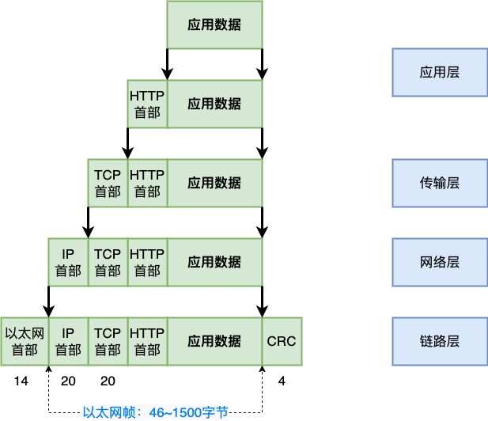

# HTTP 网络数据报

## 数据报格式

## 以太网数据报格式

| 字段           | 含义                                                                                                                                                                                                                                           |
| -------------- | ---------------------------------------------------------------------------------------------------------------------------------------------------------------------------------------------------------------------------------------------- |
| 前同步码       | 用来使接收端的适配器在接收 MAC 帧时能够迅速调整时钟频率，使它和发送端的频率相同。前同步码为 7 个字节，1 和 0 交替。                                                                                                                            |
| 帧开始定界符   | 帧的起始符，为 1 个字节。前 6 位 1 和 0 交替，最后的两个连续的 1 表示告诉接收端适配器：“帧信息要来了，准备接收”。                                                                                                                              |
| 目的地址       | 接收帧的网络适配器的物理地址（MAC 地址），为 6 个字节（48 比特）。作用是当网卡接收到一个数据帧时，首先会检查该帧的目的地址，是否与当前适配器的物理地址相同，如果相同，就会进一步处理；如果不同，则直接丢弃。                                   |
| 源地址         | 发送帧的网络适配器的物理地址（MAC 地址），为 6 个字节（48 比特）。                                                                                                                                                                             |
| 类型           | 上层协议的类型。由于上层协议众多，所以在处理数据的时候必须设置该字段，标识数据交付哪个协议处理。例如，字段为 0x0800 时，表示将数据交付给 IP 协议。                                                                                             |
| 数据           | 也称为效载荷，表示交付给上层的数据。以太网帧数据长度最小为 46 字节，最大为 1500 字节。如果不足 46 字节时，会填充到最小长度。最大值也叫最大传输单元（MTU）。 在 Linux 中，使用 ifconfig 命令可以查看该值，通常为 1500。                         |
| 帧检验序列 FCS | 检测该帧是否出现差错，占 4 个字节（32 比特）。发送方计算帧的循环冗余码校验（CRC）值，把这个值写到帧里。接收方计算机重新计算 CRC，与 FCS 字段的值进行比较。如果两个值不相同，则表示传输过程中发生了数据丢失或改变。这时，就需要重新传输这一帧。 |

## IP 数据报格式

IP 报头的最小长度为 20 字节，上图中每个字段的含义如下：

### 字段详解

#### 1) 版本（version）

占 4 位，表示 IP 协议的版本。通信双方使用的 IP 协议版本必须一致。目前广泛使用的 IP 协议版本号为 4，即 IPv4。

#### 2) 首部长度（网际报头长度 IHL）

占 4 位，可表示的最大十进制数值是 15。这个字段所表示数的单位是 32 位字长（1 个 32 位字长是 4 字节）。因此，当 IP 的首部长度为 1111 时（即十进制的 15），首部长度就达到 60 字节。当 IP 分组的首部长度不是 4 字节的整数倍时，必须利用最后的填充字段加以填充。

数据部分永远在 4 字节的整数倍开始，这样在实现 IP 协议时较为方便。首部长度限制为 60 字节的缺点是，长度有时可能不够用，之所以限制长度为 60 字节，是希望用户尽量减少开销。最常用的首部长度就是 20 字节（即首部长度为 0101），这时不使用任何选项。

#### 3) 区分服务（tos）

也被称为服务类型，占 8 位，用来获得更好的服务。这个字段在旧标准中叫做服务类型，但实际上一直没有被使用过。1998 年 IETF 把这个字段改名为区分服务（Differentiated Services，DS）。只有在使用区分服务时，这个字段才起作用。

#### 4) 总长度（totlen）

首部和数据之和，单位为字节。总长度字段为 16 位，因此数据报的最大长度为 2^16-1=65535 字节。

#### 5) 标识（identification）

用来标识数据报，占 16 位。IP 协议在存储器中维持一个计数器。每产生一个数据报，计数器就加 1，并将此值赋给标识字段。当数据报的长度超过网络的 MTU，而必须分片时，这个标识字段的值就被复制到所有的数据报的标识字段中。具有相同的标识字段值的分片报文会被重组成原来的数据报。

#### 6) 标志（flag）

占 3 位。第一位未使用，其值为 0。第二位称为 DF（不分片），表示是否允许分片。取值为 0 时，表示允许分片；取值为 1 时，表示不允许分片。第三位称为 MF（更多分片），表示是否还有分片正在传输，设置为 0 时，表示没有更多分片需要发送，或数据报没有分片。

#### 7) 片偏移（offset flag）

占 13 位。当报文被分片后，该字段标记该分片在原报文中的相对位置。片偏移以 8 个字节为偏移单位。所以，除了最后一个分片，其他分片的偏移值都是 8 字节（64 位）的整数倍。

#### 8) 生存时间（TTL）

表示数据报在网络中的寿命，占 8 位。该字段由发出数据报的源主机设置。其目的是防止无法交付的数据报无限制地在网络中传输，从而消耗网络资源。

路由器在转发数据报之前，先把 TTL 值减 1。若 TTL 值减少到 0，则丢弃这个数据报，不再转发。因此，TTL 指明数据报在网络中最多可经过多少个路由器。TTL 的最大数值为 255。若把 TTL 的初始值设为 1，则表示这个数据报只能在本局域网中传送。

#### 9) 协议

表示该数据报文所携带的数据所使用的协议类型，占 8 位。该字段可以方便目的主机的 IP 层知道按照什么协议来处理数据部分。不同的协议有专门不同的协议号。

例如，TCP 的协议号为 6，UDP 的协议号为 17，ICMP 的协议号为 1。

#### 10) 首部检验和（checksum）

用于校验数据报的首部，占 16 位。数据报每经过一个路由器，首部的字段都可能发生变化（如 TTL），所以需要重新校验。而数据部分不发生变化，所以不用重新生成校验值。

#### 11) 源地址

表示数据报的源 IP 地址，占 32 位。

#### 12) 目的地址

表示数据报的目的 IP 地址，占 32 位。该字段用于校验发送是否正确。

#### 13) 可选字段

该字段用于一些可选的报头设置，主要用于测试、调试和安全的目的。这些选项包括严格源路由（数据报必须经过指定的路由）、网际时间戳（经过每个路由器时的时间戳记录）和安全限制。

#### 14) 填充

由于可选字段中的长度不是固定的，使用若干个 0 填充该字段，可以保证整个报头的长度是 32 位的整数倍。

#### 15) 数据部分

表示传输层的数据，如保存 TCP、UDP、ICMP 或 IGMP 的数据。数据部分的长度不固定。

## TCP 数据报格式

### TCP 数据报字段详解

#### 源端口和目的端口字段

- TCP 源端口（Source Port）：源计算机上的应用程序的端口号，占 16 位。
- TCP 目的端口（Destination Port）：目标计算机的应用程序端口号，占 16 位。

#### 序列号字段

CP 序列号（Sequence Number）：占 32 位。它表示本报文段所发送数据的第一个字节的编号。在 TCP 连接中，所传送的字节流的每一个字节都会按顺序编号。当 SYN 标记不为 1 时，这是当前数据分段第一个字母的序列号；如果 SYN 的值是 1 时，这个字段的值就是初始序列值（ISN），用于对序列号进行同步。这时，第一个字节的序列号比这个字段的值大 1，也就是 ISN 加 1。

#### 确认号字段

TCP 确认号（Acknowledgment Number，ACK Number）：占 32 位。它表示接收方期望收到发送方下一个报文段的第一个字节数据的编号。其值是接收计算机即将接收到的下一个序列号，也就是下一个接收到的字节的序列号加 1。

#### 数据偏移字段

TCP 首部长度（Header Length）：数据偏移是指数据段中的“数据”部分起始处距离 TCP 数据段起始处的字节偏移量，占 4 位。其实这里的“数据偏移”也是在确定 TCP 数据段头部分的长度，告诉接收端的应用程序，数据从何处开始。

#### 保留字段

保留（Reserved）：占 4 位。为 TCP 将来的发展预留空间，目前必须全部为 0。

#### 标志位字段

- CWR（Congestion Window Reduce）：拥塞窗口减少标志，用来表明它接收到了设置 ECE 标志的 TCP 包。并且，发送方收到消息之后，通过减小发送窗口的大小来降低发送速率。
- ECE（ECN Echo）：用来在 TCP 三次握手时表明一个 TCP 端是具备 ECN 功能的。在数据传输过程中，它也用来表明接收到的 TCP 包的 IP 头部的 ECN 被设置为 11，即网络线路拥堵。
- URG（Urgent）：表示本报文段中发送的数据是否包含紧急数据。URG=1 时表示有紧急数据。当 URG=1 时，后面的紧急指针字段才有效。
- ACK：表示前面的确认号字段是否有效。ACK=1 时表示有效。只有当 ACK=1 时，前面的确认号字段才有效。TCP 规定，连接建立后，ACK 必须为 1。
- PSH（Push）：告诉对方收到该报文段后是否立即把数据推送给上层。如果值为 1，表示应当立即把数据提交给上层，而不是缓存起来。
- RST：表示是否重置连接。如果 RST=1，说明 TCP 连接出现了严重错误（如主机崩溃），必须释放连接，然后再重新建立连接。
- SYN：在建立连接时使用，用来同步序号。当 SYN=1，ACK=0 时，表示这是一个请求建立连接的报文段；当 SYN=1，ACK=1 时，表示对方同意建立连接。SYN=1 时，说明这是一个请求建立连接或同意建立连接的报文。只有在前两次握手中 SYN 才为 1。
- FIN：标记数据是否发送完毕。如果 FIN=1，表示数据已经发送完成，可以释放连接。

#### 窗口大小字段

窗口大小（Window Size）：占 16 位。它表示从 Ack Number 开始还可以接收多少字节的数据量，也表示当前接收端的接收窗口还有多少剩余空间。该字段可以用于 TCP 的流量控制。

#### TCP 校验和字段

校验位（TCP Checksum）：占 16 位。它用于确认传输的数据是否有损坏。发送端基于数据内容校验生成一个数值，接收端根据接收的数据校验生成一个值。两个值必须相同，才能证明数据是有效的。如果两个值不同，则丢掉这个数据包。Checksum 是根据伪头 + TCP 头 + TCP 数据三部分进行计算的。

#### 紧急指针字段

紧急指针（Urgent Pointer）：仅当前面的 URG 控制位为 1 时才有意义。它指出本数据段中为紧急数据的字节数，占 16 位。当所有紧急数据处理完后，TCP 就会告诉应用程序恢复到正常操作。即使当前窗口大小为 0，也是可以发送紧急数据的，因为紧急数据无须缓存。

#### 可选项字段

选项（Option）：长度不定，但长度必须是 32bits 的整数倍。

## HTTP 数据报格式

### Request

#### 请求方式 Method

**GET**：请求获取 Request——URL 所标识的资源

**POST**：在 Request——URL 所标识的资源后附加资源

**HEAD**：请求获取由 Request——URL 所标识的资源的响应消息报头

**PUT**：请求服务器存储一个资源，由 Request——URL 作为其标识

**DELETE**：请求服务器删除由 Request——URL 所标识的资源

**TRACE**：请求服务器回送收到的请求信息（用于测试和诊断）

**CONNECT**：保留

**OPTIONS**：请求查询服务器性能

#### URL

URI 全名为 Uniform Resource Indentifier（统一资源标识），用来唯一的标识一个资源，是一个通用的概念，URI 由两个主要的子集 URL 和 URN 组成。URL 全名为 Uniform Resource Locator（统一资源定位），通过描述资源的位置来标识资源。URN 全名为 Uniform Resource Name（统一资源命名），通过资源的名字来标识资源，与其所处的位置无关，这样即使资源的位置发生变动，其 URN 也不会变化。

#### 协议版本 Version

格式为 HTTP/主版本号.次版本号，常用为：HTTP/1.1 HTTP/1.0

#### 请求头部

**Host**：接受请求的服务器地址，可以是 IP 或者是域名

**User-Agent**：发送请求的应用名称

**Connection**：指定与连接相关的属性，例如（Keep_Alive，长连接）

**Accept-Charset**：通知服务器端可以发送的编码格式

**Accept-Encoding**：通知服务器端可以发送的数据压缩格式

**Accept-Language**：通知服务器端可以发送的语言

### Response

#### 状态码

状态码，100-199 表示请求已收到继续处理，200-299 表示成功，300-399 表示资源重定向，400-499 表示客户端请求出错，500-599 表示服务器端出错
常见的状态码有：
**200**：响应成功
**302**：跳转，重定向
**400**：客户端有语法错误
**403**：服务器拒绝提供服务
**404**：请求资源不存在
**500**：服务器内部错误

#### 响应头部

**Server**：服务器应用软件的名称和版本

**Content-Type**：响应正文的类型

**Content-Length**：响应正文的长度

**Content-Charset**：响应正文所使用的编码

**Content-Encoding**：响应正文使用的数据压缩格式

**Content-Language**：响应正文使用的语言

## 参考

[以太网数据帧格式（结构）图解](http://c.biancheng.net/view/6391.html)
[IP 数据报格式详解](http://c.biancheng.net/view/6411.html)
[TCP 报文格式解析](http://c.biancheng.net/view/6441.html)
[HTTP 协议数据包格式（报文段）](https://blog.csdn.net/qq_44938404/article/details/105577440)
