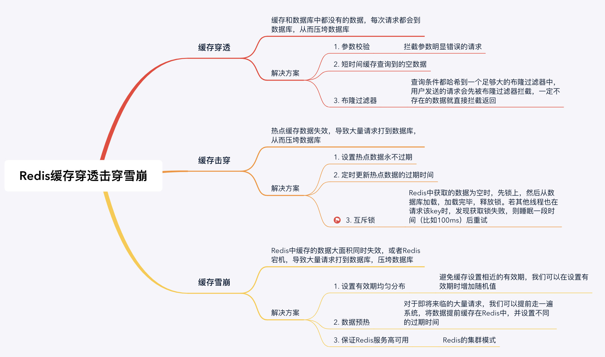

# 缓存穿透、缓存击穿、缓存雪崩

## 缓存穿透

缓存穿透：缓存和数据库中都没有的数据，可用户还是源源不断的发起请求，导致每次请求都会到数据库，从而压垮数据库。

### 穿透解决方案

#### 1. 业务层校验

用户发过来的请求，根据请求参数进行校验，对于明显错误的参数，直接拦截返回。

#### 2. 不存在数据设置短过期时间

对于某个查询为空的数据，可以将这个空结果进行Redis缓存，但是设置很短的过期时间，比如30s，可以根据实际业务设定。注意一定不要影响正常业务。

#### 3. 布隆过滤器

我们可以将查询条件都哈希到一个足够大的布隆过滤器中，用户发送的请求会先被布隆过滤器拦截，一定不存在的数据就直接拦截返回了，从而避免下一步对数据库的压力。

## 缓存击穿

缓存击穿：Redis中一个热点key在失效的同时，大量的请求过来，从而会全部到达数据库，压垮数据库

### 击穿解决方案

#### 1. 设置热点数据永不过期

对于某个需要频繁获取的信息，缓存在Redis中，并设置其永不过期。当然这种方式比较粗暴，对于某些业务场景是不适合的。

#### 2. 定时更新

比如这个热点数据的过期时间是1h，那么每到59minutes时，通过定时任务去更新这个热点key，并重新设置其过期时间。

#### 3. 互斥锁

互斥锁简单来说就是在Redis中根据key获得的value值为空时，先锁上，然后从数据库加载，加载完毕，释放锁。若其他线程也在请求该key时，发现获取锁失败，则睡眠一段时间（比如100ms）后重试。(**解决缓存击穿比较常用的方法**)

## 缓存雪崩

缓存雪崩：Redis中缓存的数据大面积同时失效，或者Redis宕机，从而会导致大量请求直接到数据库，压垮数据库。

### 雪崩解决方案

#### 1. 设置有效期均匀分布

避免缓存设置相近的有效期，我们可以在设置有效期时增加随机值；

或者统一规划有效期，使得过期时间均匀分布。

#### 2. 数据预热

对于即将来临的大量请求，我们可以提前走一遍系统，将数据提前缓存在Redis中，并设置不同的过期时间。

#### 3. 保证Redis服务高可用

Redis的哨兵模式和集群模式，为防止Redis集群单节点故障，可以通过这两种模式实现高可用。

<!-- [脑图下载](/_media/xmind/backend/redis/Redis_cache_avalanche_breakdown_penetration.xmind) -->

**参考**
[https://www.cnblogs.com/ysocean/p/12452023.html](https://www.cnblogs.com/ysocean/p/12452023.html)
