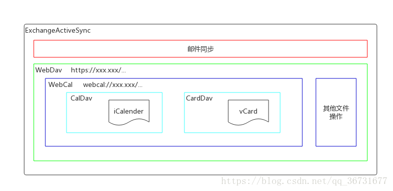

# EAS

邮件同步系统都支持 IMAP、POP3、Exchange 服务，而 Exchange 服务可以同步日历

## ExchangeActiveSync 协议

- 标准：该协议不是国际标准，但却是事实上的协议，该协议的技术来源于微软
- 功能描述：该协议可实现从服务器到客户端的电子邮件，联系人，日历，任务和便笺的同步（国内厂商大部分都只看中邮件同步的功能）
- 基础协议：XML，HTTP，HTTPS
- 支援软件：谷歌家 Gmail、微软家 Outlook、腾讯家的 Foxmail 等
- 协议应用：可引导用户向 Gmail 或者 Outlook 中添加日程订阅，并将邮件账户通过 Exchange

## WebDav

- 标准：RFC 4918
- 功能描述：基于 HTTP 的数据操作协议，提供分布式创作与版本控制功能。简单来说就是允许客户端发布、锁定和管理服务器中的部分资源，而且该操作可以是有权限的、多用户的。
- 基础协议：基于 HTTP1.1 的扩展
- 支援软件： Dropbox、坚果云、OwnCloud 等服务
- 协议应用：该协议常见于网盘系统（服务器）并被常见的操作系统所支持（客户端），允许用户将云盘以网络驱动器的形式挂载到客户端系统上，可自由的上传、修改和下载文件资源。该协议是 CalDav 协议的基础。

## WebCal

- 标准：该协议不是国际标准，但却是事实上的标准
- 功能描述：用于访问 iCalendar 文件的非官方统一资源标识符（URI）方案。简单来说就是一种自定义的 URL 标识，但是该标识被不少软件所认可，通过该协议可以访问服务器上的日程资源，也就是访问 iCalendar 文件。
- 基础协议：未知
- 支援软件：Google Calendar、Microsoft Outlook、Mozilla Lightning
- 协议应用：该标准最早被设计用于苹果的 iCal 应用程序，应用程序发起的请求以`webcal://`为开头，被服务器上的外部协议处理程序所捕获，并通过 WebDav 协议操作 iCalendar 文件。这种非国际标准的请求可能会被不兼容的应用程序拦截并认定为下载 iCalendar 文件（后缀为`.ics`）。所以综合来说，基本上可以认为下载\*.ics 文件并导入应用程序和直接使用链接`webcal://xxx.xxx.xxx/....`导入的是相同的行为。

## CalDav

- 标准：RFC 4791
- 功能描述：远程日程信息访问（共享）协议。允许客户端访问共享服务器上的日程信息。简单来说就是允许具有权限的用户访问一份共享的日程。
- 基础协议：扩展了 WebDav 协议的规范， 并使用 iCalendar 格式的数据
- 支援软件：CalDav 服务器与操作系统（国内安卓基本都不支持）
- 协议应用：该协议被各大邮件系统所支持，利用该协议可引导用户订阅日程信息流，并将日程信息通过邮箱帐号同步至绑定的设备中。但是，国内的邮件系统基本不支持日程的订阅服务属于阉割版本，应有条件的采用国际大厂的日程订阅服务。这种日程订阅的方案虽然没有即时通讯那么快，但是和邮件的同步速度旗鼓相当。

## CardDav

- 标准：RFC 6352
- 功能描述：远程地址簿信息访问（共享）协议。允许客户端访问共享服务器上的联系人数据。简单来说就是允许具有权限的用户访问一份共享的地址簿。
- 基础协议：扩展了 WebDav 协议的规范， 并使用 vCard 格式的数据
- 支援软件：Apple Contacts、Outlook CalDav Synchronizer、GMail
- 协议应用：该协议可认为是 CalDav 协议的孪生兄弟，一般支持 CalDav 同步的邮箱系统都可以支持 CardDav 的同步。

## iCalendar

- 标准： RFC 5545
- 功能描述：日程信息文件交换格式。允许用户通过各种方法共享或发送此格式的文件，将会议请求和任务发送给其他用户。简单来说就是规范的将"时间、地点、人物"等日程中的要素写入文件中，方便多用户之间的信息传输。
- 基础协议：媒体类型应为 text/calendar，扩展名为`*.ics`
- 支援软件：好多好多，但是兼容性各有千秋
- 协议应用：可以引导用户下载 ics 文件并导入在邮件系统的日程订阅中已完成日程信息的数据同步，不过能用 webcal 链接时还是链接更妙一些。建议使用时多关注一下文件协议的格式版本，部分不兼容的版本可能会被订阅程序所拒绝。

## 参考

[简单认识 EAS/WebDav/CalDav/CardDav/WebCal/iCalendar 的含义](https://blog.csdn.net/qq_36731677/article/details/82956977)
