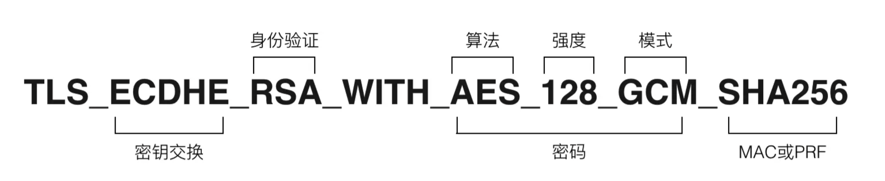
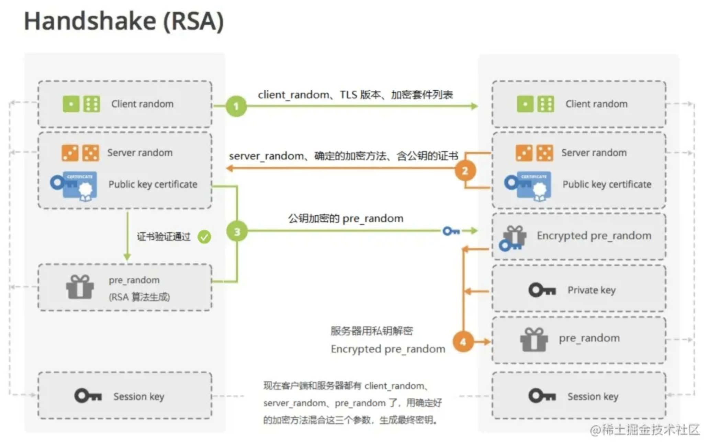
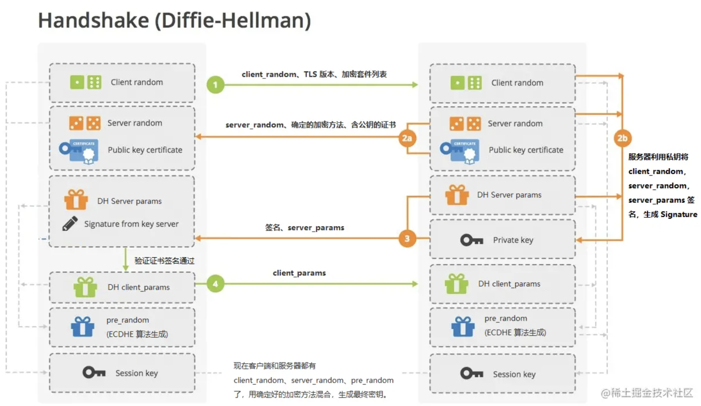
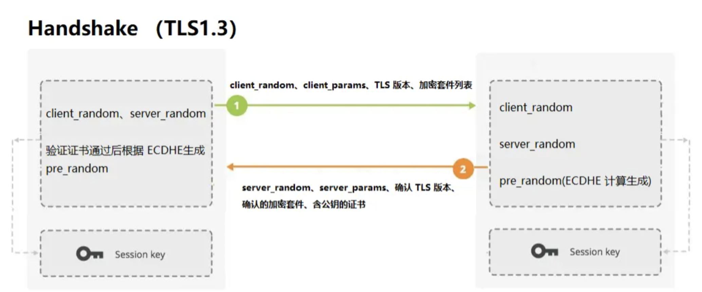

# SSL/TLS 握手连接

## TLS 发展历史

- 1996 年，SSL3.0 问世，得到大规模应用（已于 2015 年弃用）。
- 1999 年，SSL3.1 被标准化，更新为 TLS1.0（传输层安全，Transport Layer Security）。所以有，**TLS1.0 = SSL3.1**。
- 现在主流的版本是 TLS1.2（2008 年发布）。
- 未来，可能是 TLS1.3 的时代（2018 年发布）。

## 基础概念

### 1. 对称加密

加、解密使用的同一串密钥，常见的对称加密算法：DES，AES 等。

### 2. 非对称加密

加、解密使用不同的密钥，一把作为公开的公钥，另一把作为保密的私钥。公钥加密的信息，只有私钥才能解密。反之，私钥加密的信息，只有公钥才能解密。

常见的非对称加密算法：RSA，ECC 等。

RSA 算法：该算法的命名以三位科学家的姓氏缩写组合得来，在计算机网络世界，一直是最广为使用的 “非对称加密算法”。

ECC 是非对称加密里的 “后起之秀”，它基于 “椭圆曲线离散对数” 的数学难题，使用特定的曲线方程和基点生成公钥和私钥，子算法 ECDHE 用于密钥交换，ECDSA 用于数字签名。

### 3. 混合加密

在 `对称加密` 算法中只要持有密钥就可以解密。如果你和网站约定的密钥在传递途中被黑客窃取，那他就可以在之后随意解密收发的数据，通信过程也就没有机密性可言了。

在 `非对称加密` 算法中，需要应用到复杂的数学运算，虽然保证了安全，但速度很慢，比对称加密算法差了好几个数量级。

所以，TLS 里使用了 “混合加密” 的方式博采众长：在通信刚开始的时候使用 `非对称加密` 算法，解决密钥交换的问题。后续全都使用 `对称加密` 进行通信。

### 加密套件列表



### 数字证书

数字证书一般有两个作用:

1. 服务器向浏览器证明自己的身份，毕竟秘钥、甚至服务器域名都是可以伪造的。
2. 把公钥传给浏览器。

证书本身是由权威、受信任的证书颁发机构 (CA) 授予的。

## RSA 握手



**具体流程如下**：

```text
 1.浏览器向服务器发送随机数 client_random，TLS 版本和供筛选的加密套件列表。
 2.服务器接收到，立即返回 server_random，确认好双方都支持的加密套件
 以及数字证书 (证书中附带公钥 Public key certificate)。
 3.浏览器接收，先验证数字证书。若通过，接着使用加密套件的密钥协商算法 RSA
 算法生成另一个随机数 pre_random，并且用证书里的公钥加密，传给服务器。
 4.服务器用私钥解密这个被加密后的 pre_random，参考 “非对称加密”。
```

现在浏览器和服务器都拥有三样相同的凭证：`client_random`、`server_random` 和 `pre_random`。两者都用筛好的加密套件中的加密方法混合这三个随机数，生成最终的密钥。

最后，浏览器和服务器使用相同的密钥进行通信，即使用 `对称加密`。

到这里，还有两点需要注意。

- 第一：握手中的任何消息均未使用秘钥加密，它们都是明文发送的。
- 第二：TLS 握手其实是一个 双向认证 的过程，客户端和服务器都需要进行摘要认证以及收尾 (发送 Finished 消息，意为后面 HTTP 开始正式加密报文通信了)。

## DH 握手



```markdown
1.浏览器向服务器发送随机数 client_random，TLS 版本和供筛选的加密套件列表。

// RSA
-2.服务器接收到，立即返回 server_random，确认好双方都支持的加密套件 -以及数字证书 (证书中附带公钥)。
// DH
+2.服务器接收到，立即返回 server_random，确认好双方都支持的加密套件 +以及数字证书 (证书中附带公钥)。 +同时服务器利用私钥将 client_random，server_random，server_params 签名， +生成服务器签名。然后将签名和 server_params 也发送给客户端。 +这里的 server_params 为 DH 算法所需参数。

// RSA
-3.浏览器接收，先验证数字证书。 -若通过，接着使用加密套件的密钥协商算法 RSA 算法 -生成另一个随机数 pre*random，并且用证书里的公钥加密，传给服务器。
// DH
+3.浏览器接收，先验证数字证书和 *签名\_。 +若通过，将 client_params 传递给服务器。 +这里的 client_params 为 DH 算法所需参数。

-4.服务器用私钥解密这个被加密后的 pre_random，参考 “非对称加密”。
+4.现在客户端和服务器都有 client_params、server_params 两个参数， +因 ECDHE 计算基于 “椭圆曲线离散对数”，通过这两个 DH 参数就能计算出 pre_random。
```

现在浏览器和服务器都拥有三样相同的凭证：client_random、server_random 和 pre_random，后续步骤与 RSA 握手一致。

DH 握手前向安全性

## TLS1.2 握手

有了前面一节的概念后，TLS1.2 握手理解起来就显得毫不费力了。因为主流的 TLS1.2 握手就是上节完整的 DH 握手流程。

## TLS1.3 握手



流程梳理：

```text
// 原 DH 握手
-1.浏览器向服务器发送 client_random，TLS 版本和供筛选的加密套件列表。
// TLS1.3 优化
+1.浏览器向服务器发送 client_params，client_random，TLS 版本和供筛选的加密套件列表。

// 原 DH 握手
-2...
// TLS1.3 优化
+2.服务器返回：server_random、server_params、TLS 版本、确定的加密套件方法以及证书。
+浏览器接收，先验证数字证书和签名。
+现在双方都有 client_params、server_params，可以根据 ECDHE 计算出 pre_random 了。
```

最后，集齐三个参数，生成最终秘钥。

如你所见，TLS1.3 客户端和服务器之间只需要一次往返就完成 (TLS1.2 需要两次往返来完成握手)，即 1-RTT 握手。当然，如果利用 PSK 我们甚至能优化到 0-RTT (这并不好，安全受到质疑~)。

### 中间代理人问题是如何解决的呢?

## 参考

- [TLS 详解握手流程](https://juejin.cn/post/6895624327896432654)
- [图解 TLS 握手连接](https://cloud.tencent.com/developer/article/1593352)
