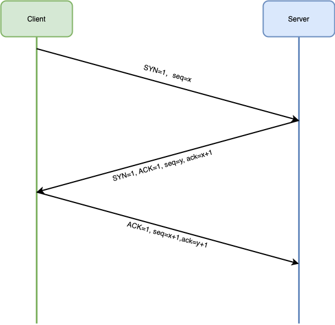
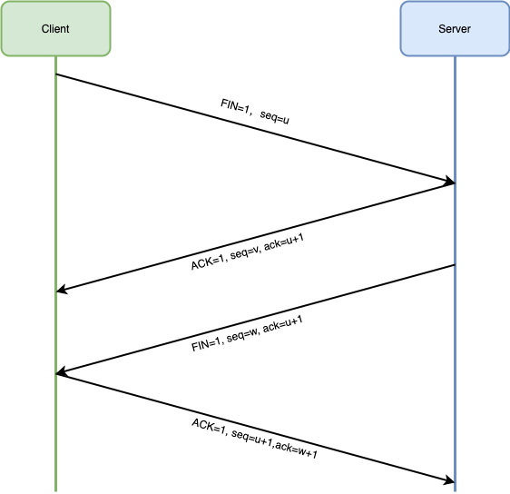

# TCP 3 次握手 4 次挥手

## TCP 协议(报文)

### 源端口号 & 目的端口号

TCP 报头中的源端口号和目的端口号同 IP 数据报中的源 IP 与目的 IP 唯一确定一条 TCP 连接

### 序号 & 确认序号

**序号**: 用来标识 TCP 发端向 TCP 收端发送的数据字节流

**确认序号**: 由于该报文为 SYN 报文，ACK 标志为 0，故没有确认序号（ACK 标志为 1 时确认序号才有效）TCP 协议规定，只有 ACK=1 时有效，也规定连接建立后所有发送的报文的 ACK 必须为 1

### 头部长度

该字段占用 4 位，用来表示报文首部的长度，单位是 4Byte。

### 预留 6 位

长度为 6 位，作为保留字段，暂时没有什么用处。

### 标志位 TCP Flags

#### 紧急 URG (Urgent)

当 URG = 1 的时候，表示紧急指针（Urgent Pointer）有效。
它告诉系统此报文段中有紧急数据，应尽快传送，而不要按原来的排队顺序来传送。
URG 要与首部中的 紧急指针 字段配合使用。

#### 确认 ACK (Acknowlegemt)

当 ACK = 1 的时候，确认号（Acknowledgemt Number）有效。
一般称携带 ACK 标志的 TCP 报文段为「确认报文段」。
TCP 规定，在连接建立后所有传送的报文段都必须把 ACK 设置为 1。

#### 推送 PSH (Push)

当 PSH = 1 的时候，表示该报文段高优先级，接收方 TCP 应该尽快推送给接收应用程序，而不用等到整个 TCP 缓存都填满了后再交付。

#### 复位 RST (Reset)

当 RST = 1 的时候，表示 TCP 连接中出现严重错误，需要释放并重新建立连接。
一般称携带 RST 标志的 TCP 报文段为「复位报文段」.

#### 同步 SYN (SYNchronization)

当 SYN = 1 的时候，表明这是一个请求连接报文段。
一般称携带 SYN 标志的 TCP 报文段为「同步报文段」。
在 TCP 三次握手中的第一个报文就是同步报文段，在连接建立时用来同步序号。
对方若同意建立连接，则应在响应的报文段中使 SYN = 1 和 ACK = 1。

#### 终止 FIN (Finis)

当 FIN = 1 时，表示此报文段的发送方的数据已经发送完毕，并要求释放 TCP 连接。
一般称携带 FIN 的报文段为「结束报文段」。
在 TCP 四次挥手释放连接的时候，就会用到该标志。

### 窗口大小 Window Size

占 2 字节。
该字段明确指出了现在允许对方发送的数据量，它告诉对方本端的 TCP 接收缓冲区还能容纳多少字节的数据，这样对方就可以控制发送数据的速度。
窗口大小的值是指，从本报文段首部中的确认号算起，接收方目前允许对方发送的数据量。
例如，假如确认号是 701 ，窗口字段是 1000。这就表明，从 701 号算起，发送此报文段的一方还有接收 1000 （字节序号是 701 ~ 1700） 个字节的数据的接收缓存空间。

### 校验和 TCP Checksum

占 2 个字节。
由发送端填充，接收端对 TCP 报文段执行 CRC 算法，以检验 TCP 报文段在传输过程中是否损坏，如果损坏这丢弃。
检验范围包括首部和数据两部分，这也是 TCP 可靠传输的一个重要保障。

### 紧急指针 Urgent Pointer

占 2 个字节。
仅在 URG = 1 时才有意义，它指出本报文段中的紧急数据的字节数。
当 URG = 1 时，发送方 TCP 就把紧急数据插入到本报文段数据的最前面，而在紧急数据后面的数据仍是普通数据。
因此，紧急指针指出了紧急数据的末尾在报文段中的位置

## 3 次握手

### 为什么不能用两次握手进行连接？

主要是为了防止已失效的连接请求报文段突然又传到了 B,因而产生错误。假定出现一种异常情况，即 A 发出的第一个连接请求报文段并没有丢失，而是在某些网络结 点长时间滞留了，一直延迟到连接释放以后的某个时间才到达 B，本来这是一个早已失效的报文段。但 B 收到此失效的连接请求报文段后，就误认为是 A 又发出一次 新的连接请求，于是就向 A 发出确认报文段，同意建立连接。假定不采用三次握手，那么只要 B 发出确认，新的连接就建立了，这样一直等待 A 发来数据，B 的许多 资源就这样白白浪费了。

## 4 次挥手

### 四次挥手释放连接时，等待 2MSL 的意义？

1. 为了保证 A 发送的最有一个 ACK 报文段能够到达 B。这个 ACK 报文段有可能丢失，因而使处在 LAST-ACK 状态的 B 收不到对已发送的 FIN 和 ACK 报文段的确认。B 会超时重传这个 FIN 和 ACK 报文段，而 A 就能在 2MSL 时间内收到这个重传的 ACK+FIN 报文段。接着 A 重传一次确认。

2. 防止上面提到的已失效的连接请求报文段出现在本连接中，A 在发送完最有一个 ACK 报文段后，再经过 2MSL，就可以使本连接持续的时间内所产生的所有报文段都从网络中消失。

## 参考

[TCP 报文格式](https://www.cnblogs.com/shineyoung/p/10656914.html)
[理解 TCP（二）：报文结构](https://www.jianshu.com/p/421dd948a42a)
[TCP 报文格式详解](https://www.cnblogs.com/feng9exe/p/8058891.html)
[TCP 三次握手四次挥手详解](https://zhuanlan.zhihu.com/p/40013850)
