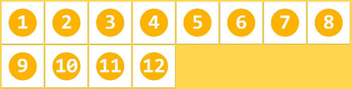

# flex 布局

## 容器指定为 flex

任何一个容器都可以指定为 Flex 布局

```css
.box {
  display: flex;
}
```

行内元素也可以使用 Flex 布局

```css
.box {
  display: inline-flex;
}
```

Webkit 内核的浏览器，必须加上 `-webkit` 前缀

```css
.box {
  display: -webkit-flex; /* Safari */
  display: flex;
}
```

## 基本概念


## 容器属性

以下 6 个属性设置在容器上

> - flex-direction
> - flex-wrap
> - flex-flow
> - justify-content
> - align-items
> - align-content

### flex-direction

`flex-direction` 决定主轴方向

```css
.box {
  flex-direction: row | row-reverse | column | column-reverse;
}
```


> - row（默认值）：主轴为水平方向，起点在左端。
> - row-reverse：主轴为水平方向，起点在右端。
> - column：主轴为垂直方向，起点在上沿。
> - column-reverse：主轴为垂直方向，起点在下沿。

### flex-wrap

默认情况下，项目都排在一条线（又称"轴线"）上。`flex-wrap`属性定义，如果一条轴线排不下，如何换行

```css
.box {
  flex-wrap: nowrap | wrap | wrap-reverse;
}
```


`nowrap`（默认）：不换行


`wrap`：换行，第一行在上方



`wrap-reverse`：换行，第一行在下方


### flex-flow

flex-flow 属性是 flex-direction 属性和 flex-wrap 属性的简写形式，默认值为 row nowrap。

```css
.box {
  flex-flow: <flex-direction> || <flex-wrap>;
}
```

### justify-content

`justify-content` 属性定义了项目在主轴上的对齐方式

```css
.box {
  justify-content: flex-start | flex-end | center | space-between | space-around;
}
```


它可能取 5 个值，具体对齐方式与轴的方向有关

> - flex-start（默认值）：左对齐
> - flex-end：右对齐
> - center： 居中
> - space-between：两端对齐，项目之间的间隔都相等。
> - space-around：每个项目两侧的间隔相等。所以，项目之间的间隔比项目与边框的间隔大一倍。

### align-items

`align-items`属性定义项目在交叉轴上如何对齐

```css
.box {
  align-items: flex-start | flex-end | center | baseline | stretch;
}
```


> - flex-start：交叉轴的起点对齐。
> - flex-end：交叉轴的终点对齐。
> - center：交叉轴的中点对齐。
> - baseline: 项目的第一行文字的基线对齐。
> - stretch（默认值）：如果项目未设置高度或设为 auto，将占满整个容器的高度。

### align-content

`align-content` 属性定义了多根轴线的对齐方式。如果项目只有一根轴线，该属性不起作用。


> - flex-start：与交叉轴的起点对齐。
> - flex-end：与交叉轴的终点对齐。
> - center：与交叉轴的中点对齐。
> - space-between：与交叉轴两端对齐，轴线之间的间隔平均分布。
> - space-around：每根轴线两侧的间隔都相等。所以，轴线之间的间隔比轴线与边框的间隔大一倍。
> - stretch（默认值）：轴线占满整个交叉轴。

## 项目属性

> - order
> - flex-grow
> - flex-shrink
> - flex-basis
> - flex
> - align-self

### order

`order`属性定义项目的排列顺序。数值越小，排列越靠前，默认为 0。

```css
.item {
  order: <integer>;
}
```


### flex-grow

`flex-grow` 属性定义项目的放大比例，默认为 0，即如果存在剩余空间，也不放大

```css
.item {
  flex-grow: <number>; /* default 0 */
}
```


如果所有项目的 flex-grow 属性都为 1，则它们将等分剩余空间（如果有的话）。如果一个项目的 flex-grow 属性为 2，其他项目都为 1，则前者占据的剩余空间将比其他项多一倍。

### flex-shrink

flex-shrink 属性定义了项目的缩小比例，默认为 1，即如果空间不足，该项目将缩小。

```css
.item {
  flex-shrink: <number>; /* default 1 */
}
```


### flex-basis

flex-basis 属性定义了在分配多余空间之前，项目占据的主轴空间（main size）。浏览器根据这个属性，计算主轴是否有多余空间。它的默认值为 auto，即项目的本来大小。

```css
.item {
  flex-basis: <length> | auto; /* default auto */
}
```

它可以设为跟 width 或 height 属性一样的值（比如 350px），则项目将占据固定空间。

### flex

flex 属性是 flex-grow, flex-shrink 和 flex-basis 的简写，默认值为 0 1 auto。后两个属性可选。

```css
.item {
  flex: none | [ < 'flex-grow' > < 'flex-shrink' >? || < 'flex-basis' > ];
}
```

### align-self

align-self 属性允许单个项目有与其他项目不一样的对齐方式，可覆盖 align-items 属性。默认值为 auto，表示继承父元素的 align-items 属性，如果没有父元素，则等同于 stretch。

```css
.item {
  align-self: auto | flex-start | flex-end | center | baseline | stretch;
}
```


## 参考

- [Flex 布局教程：语法篇](https://ruanyifeng.com/blog/2015/07/flex-grammar.html)
