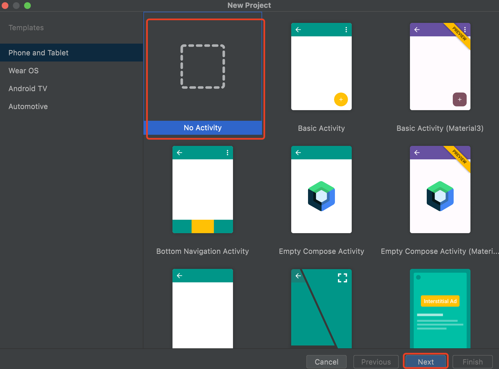
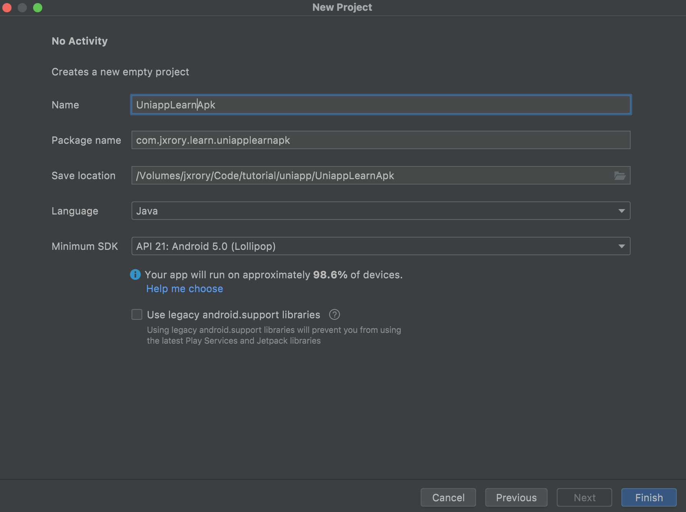
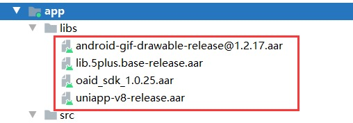

# Android 离线打包

## 准备工程

### 新建工程

打开 Android studio 新建一个空白项目



填写项目信息



## 配置工程

### 基础库配置



AndroidX 版本需添加如下资源

```java
implementation fileTree(include: ['*.jar'], dir: 'libs')
implementation fileTree(include: ['*.aar'], dir: 'libs')
implementation 'androidx.appcompat:appcompat:1.0.0'
implementation 'androidx.legacy:legacy-support-v4:1.0.0'
implementation 'androidx.recyclerview:recyclerview:1.0.0'
implementation 'com.facebook.fresco:fresco:2.5.0'
implementation "com.facebook.fresco:animated-gif:2.5.0"
implementation 'com.github.bumptech.glide:glide:4.9.0'
implementation 'com.alibaba:fastjson:1.1.46.android'
```

uni-app 配置时需要在 build.gradle 中添加 aaptOptions 配置

```java
aaptOptions {
    additionalParameters '--auto-add-overlay'
    ignoreAssetsPattern "!.svn:!.git:.*:!CVS:!thumbs.db:!picasa.ini:!*.scc:*~"
}
```

### 应用配置

#### 配置 Appkey

3.1.10 版本起需要申请 Appkey，申请请[参考](https://nativesupport.dcloud.net.cn/AppDocs/usesdk/appkey)

打开 Androidmanifest.xml， 导航到 Application 节点，创建 meta-data 节点，name 为 dcloud_appkey，value 为申请的 AppKey 如下：

```xml
<application
  ...>
  <meta-data
      android:name="dcloud_appkey"
      android:value="替换为自己申请的Appkey" />
```

#### 配置应用版本号

#### 配置应用名称

打开 app-> src -> main -> res -> values -> strings.xml 文件，修改“app_name”字段值，该值为安装到手机上桌面显示的应用名称，建议与 manifest.json 中 name（基础配置中的应用名称）对应。

#### 配置应用启动页及 provider 节点

将下述 activity 信息添加到 Androidmanifest.xml 的 application 节点中
