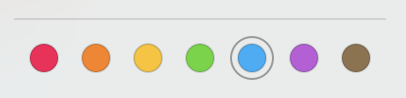

# 搭建 CalDAV 和 CardDAV 服务器 - Radicale

## Installation

```bash
python3 -m pip install --upgrade radicale
python3 -m radicale --storage-filesystem-folder=~/.var/lib/radicale/collections
```

可以在浏览器中打开连接 [http://localhost:5232/](http://localhost:5232/), 使用任何用户名和密码登录.

## Basic Configuration

**Radicale** 会尝试载入以下配置文件 `/etc/radicale/config` 和 `~/.config/radicale/config`, 可用通过命令行参数 `--config /path/to/config` 或者 `RADICALE_CONFIG` 环境变量指定加载的配置文件.

### Authentication

#### The secure way

使用 `htpasswd` 生成用户名密码

```bash
# Create a new htpasswd file with the user "user1"
$ htpasswd -c /path/to/users user1
New password:
Re-type new password:
# Add another user
$ htpasswd /path/to/users user2
New password:
Re-type new password:
```

```config
[auth]
type = htpasswd
htpasswd_filename = /path/to/users
# encryption method used in the htpasswd file
htpasswd_encryption = md5
```

#### The simple but insecure way

!> 尽量选择第一种方式, 密码会有加密处理

```text
user1:password1
user2:password2
```

```bash
[auth]
type = htpasswd
htpasswd_filename = /path/to/users
# encryption method used in the htpasswd file
htpasswd_encryption = plain
```

### Addresses

设置服务器端口

```config
[server]
hosts = 0.0.0.0:5232, [::]:5232
```

### Storage

存储文件地址

```config
[storage]
filesystem_folder = /path/to/storage
```

### Limits

```config
[server]
max_connections = 20
# 100 Megabyte
max_content_length = 100000000
# 30 seconds
timeout = 30

[auth]
# Average delay after failed login attempts in seconds
delay = 1
```

## Docker Installation

### 配置文件

```bash
[auth]
type = htpasswd
# note: that's a path inside the container
htpasswd_filename = /var/radicale/users
# encryption method used in the htpasswd file
htpasswd_encryption = bcrypt

[server]
hosts = 0.0.0.0:8000

[storage]
filesystem_folder = /var/radicale/collections
```

### 启动

```bash
docker run -v /srv/radicale/data:/var/radicale -p80:8000 -n radicale xlrl/radicale
```

### 创建用户

```bash
# Create a new htpasswd file with the user "user1"
docker exec -ti radicale htpasswd -B -c /var/radicale/users user1
New password:
Re-type new password:
# Add another user
docker exec -ti radicale htpasswd -B -c /var/radicale/users user2
New password:
Re-type new password:
```

## 问题: TODO

- [X] Mac和iOS系统的日历系统还是无法同步

!> 开启nginx反向代理 + ssl


## 杂记

icloud 任务颜色板



## 参考

[Creating CalDAV & CardDAV Server](https://www.webdavsystem.com/server/creating_caldav_carddav/)
[developing-a-caldav-server](https://stackoverflow.com/questions/14910553/developing-a-caldav-server)
[Developing a CalDav server](https://tipsfordev.com/developing-a-caldav-server)
[The Five Best Open Source Calendar Servers for Linux](https://www.linux.com/training-tutorials/five-best-open-source-calendar-servers-linux/)

**搭建**:

[install-radicale-caldav-server](https://automationadmin.com/2017/07/install-radicale-caldav-server/)
[docker-radicale](https://github.com/xlrl/docker-radicale)

**官方权威文档**:
[radicale - 文档](https://radicale.org/3.0.html)

**项目**:

[fennel :go](https://github.com/swordlordcodingcrew/fennel.git)
[kcaldav :c](https://github.com/kristapsdz/kcaldav.git)
