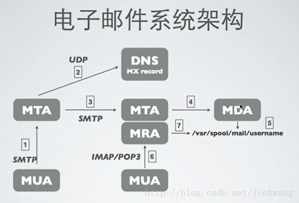
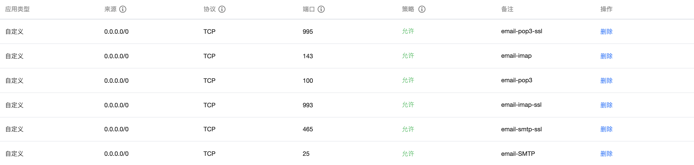
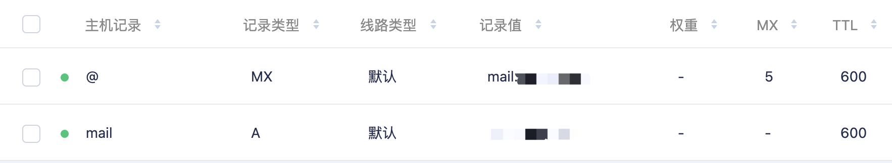

# email

## 原理



电子邮件基本概念:

**MUA（Mail User Agent）**接收邮件所使用的邮件客户端，使用 IMAP 或 POP3 协议与服务器通信；

**MTA（Mail Transfer Agent）** 通过 SMTP 协议发送、转发邮件；

**MDA（Mail Deliver Agent）**将 MTA 接收到的邮件保存到磁盘或指定地方，通常会进行垃圾邮件及病毒扫描；

**MRA（Mail Receive Agent）**负责实现 IMAP 与 POP3 协议，与 MUA 进行交互；

**SMTP（Simple Mail Transfer Protocol）**传输发送邮件所使用的标准协议；

**IMAP（Internet Message Access Protocol）**接收邮件使用的标准协议之一；

**POP3（Post Office Protocol 3）** 接收邮件使用的标准协议之一。

邮件服务器基本都有`MTA`，`MDA`，`MRA` 组成

常用的 MUA 有：`outlook`、`thunderbird`、`Mac Mail`、`mutt`；

常用的 MTA 服务有：`sendmail`、`postfix`；

常用的 MDA 有：`procmail`、`dropmail`；

常用的 MRA 有：`dovecot`。

## 搭建邮件服务器

!> 服务器: Centos

**选型**:

- MTA: postfix
- MDA: dropmail
- MRA: dovecot

**IMAP 与 POP3 区别**:


### 环境准备

#### 端口开放

端口有 25（SMTP 服务，用于发送邮件），110（pop3 服务，用于接收邮件）143（imap 服务，用于接收邮件）

只想用 pop3 服务，那么我们只需要打开 110 和 25 端口即可，如果我们使用了 ssl 的话，

`pop3`就需要开放我们的 465（发件） 995(收件)端口

`imap`就需要开放我们的 465（发件） 993(收件)端口



#### 移除 sendmail

```bash
yum remove sendmail
```

#### 域名解析配置

添加 A 记录和 mx 记录



#### 修改 hostname & MTA

```bash
hostnamectl set-hostname mail.jxrory.com
```

```bash
alternatives --list

ld	auto	/usr/bin/ld.bfd
libnssckbi.so.x86_64	auto	/usr/lib64/pkcs11/p11-kit-trust.so
mta	auto	/usr/sbin/sendmail.postfix
cifs-idmap-plugin	auto	/usr/lib64/cifs-utils/cifs_idmap_sss.so
```

```bash
alternatives --config mta
```

### 安装配置 postfix

**postfix 服务程序主配置文件中的重要参数**:

| 参数            | 作用                     |
| --------------- | ------------------------ |
| myhostname      | 邮局系统的主机名         |
| mydomain        | 邮局系统的域名           |
| myorigin        | 从本机发出邮件的域名名称 |
| inet_interfaces | 监听的网卡接口           |
| mydestination   | 可接收邮件的主机名或域名 |
| mynetworks      | 设置可转发哪些主机的邮件 |
| relay_domains   | 设置可转发哪些网域的邮件 |

#### Install postfix

```bash
yum install postfix
```

#### 配置 postfix

```bash
vim /etc/postfix/main.cf
```

修改内容：

```bash
# 75行: 取消注释，设置hostname
myhostname = mail.abc.com
# 83行: 取消注释，设置域名
mydomain = abc.com
# 99行: 取消注释
myorigin = $mydomain
# 116行: 默认是localhost，我们需要修改成all
inet_interfaces = all
# 119行: 推荐ipv4，如果支持ipv6，则可以为all
inet_protocols = ipv4
# 164行: 添加
mydestination = $myhostname, localhost.$mydomain, localhost, $mydomain
mydestination = $myhostname, localhost.$mydomain, localhost
# 264行: 取消注释，指定内网和本地的IP地址范围
mynetworks = 127.0.0.0/8
# 419行: 取消注释，邮件保存目录
 home_mailbox = Maildir/
# 571行: 添加
smtpd_banner = $myhostname ESMTP
# 添加到最后
# 规定邮件最大尺寸为10M
message_size_limit = 10485760
# 规定收件箱最大容量为1G
mailbox_size_limit = 1073741824
# SMTP认证
smtpd_sasl_type = dovecot
smtpd_sasl_path = private/auth
smtpd_sasl_auth_enable = yes
smtpd_sasl_security_options = noanonymous
smtpd_sasl_local_domain = $myhostname
smtpd_recipient_restrictions = permit_mynetworks,permit_auth_destination,permit_sasl_authenticated,reject
```

### 安装配置 dovecot

#### Install dovecot

```bash
yum install dovecot
```

#### 配置 dovecot

**dovecot.conf**:

```bash
vim /etc/dovecot/dovecot.conf
```

```bash
# 26行: 如果不使用IPv6，请修改为*
listen = *
#在主配置文件中的第48行，设置允许登录的网段地址，也就是说我们可以在这里限制只有来自于某个网段的用户才能使用电子邮件系统。如果想允许所有人都能使用，则不用修改本参数
login_trusted_networks = 192.168.10.0/24更改内容
```

**10-auth.conf**:

```bash
vim /etc/dovecot/conf.d/10-auth.conf
```

```bash
# 9行: 取消注释并修改 disable_plaintext_auth = no
# 97行: 添加 auth_mechanisms = plain login
```

**10-mail.conf**:

```bash
vim /etc/dovecot/conf.d/10-mail.conf
```

```bash
# 30行: 取消注释并添加
mail_location = maildir:~/Maildir
```

**10-master.conf**:

```bash
vim /etc/dovecot/conf.d/10-master.conf
```

```bash
# 88-90行: 取消注释并添加 # Postfix smtp验证
unix_listener /var/spool/postfix/private/auth {
    mode = 0666
    user = postfix
    group = postfix
}
```

**vim /etc/dovecot/conf.d/10-ssl.conf**:

```bash
vim /etc/dovecot/conf.d/10-ssl.conf
```

```bash
# 8行: 将ssl的值修改为
ssl = no
```

启动 dovecot 并添加到开机自启

```bash
systemctl restart dovecot
systemctl enable dovecot
```

## 测试

### 创建用户

```bash
useradd admin
passwd admin
```

## SSL 配置

本人使用的是 [acme.sh 证书生成](/OpsDev/ssl-acme.sh.md)

### 配置 Postfix 和 Dovecot

**postfix/main.cf**:

```bash
vim /etc/postfix/main.cf
```

```bash
# 添加到最后
smtpd_use_tls = yes
smtpd_tls_cert_file = /etc/pki/tls/certs/server.crt
smtpd_tls_key_file = /etc/pki/tls/certs/server.key
smtp_tls_session_cache_database = btree:${data_directory}/smtp_scache
smtpd_tls_session_cache_database = btree:${data_directory}/smtpd_scache
smtpd_tls_loglevel = 0
smtpd_tls_auth_only = yes
```

**postfix/master.cf**:

```bash
vim /etc/postfix/master.cf
```

```bash
# 17-18行: 取消注释
smtps       inet   n       -       n       -       -       smtpd
  -o smtpd_tls_wrappermode=yes
```

**dovecot/conf.d/10-ssl.conf**:

```bash
vim /etc/dovecot/conf.d/10-ssl.conf
```

```bash
# 6行: 取消注释
ssl = yes
# 12,13行: 指定证书
ssl_cert = </etc/pki/tls/certs/server.crt
ssl_key = </etc/pki/tls/certs/server.key
```

**端口开发**:

```bash
#开放SSL端口(端口的话，SMTP使用的是465, POP3使用995, IMAP使用993)
firewall-cmd --add-port={465/tcp,995/tcp,993/tcp} --permanent
firewall-cmd --reload
```

**重启服务**:

```bash
systemctl restart postfix
systemctl restart dovecot

systemctl stop postfix
systemctl stop dovecot

systemctl status postfix
systemctl status dovecot

systemctl start postfix
systemctl start dovecot
```

## 参考

[基础邮件原理（MUA,MTA,MDA）](https://www.cnblogs.com/demonxian3/p/6281839.html)
[centos7 搭建 postfix 邮件服务器](https://www.cnblogs.com/operationhome/p/9056870.html)
[centos7 邮件服务器 SSL 配置](https://www.cnblogs.com/operationhome/p/9084446.html)
