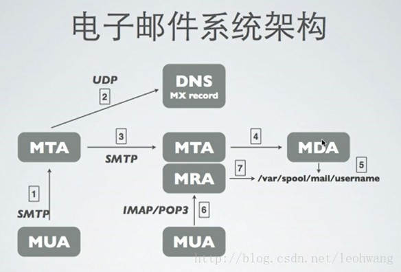
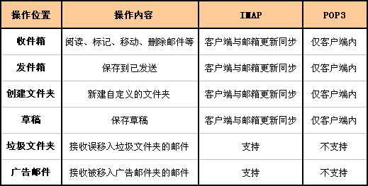
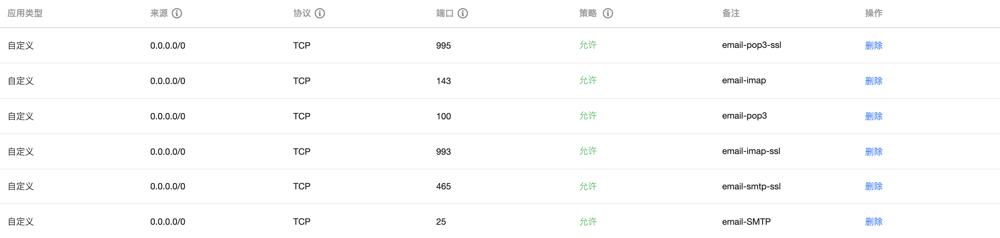
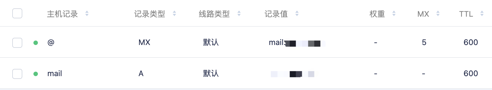

# 搭建邮件服务器

## 基础概念



电子邮件基本概念:

**MUA（Mail User Agent）**接收邮件所使用的邮件客户端，使用 IMAP 或 POP3 协议与服务器通信；

**MTA（Mail Transfer Agent）** 通过 SMTP 协议发送、转发邮件；

**MDA（Mail Deliver Agent）**将 MTA 接收到的邮件保存到磁盘或指定地方，通常会进行垃圾邮件及病毒扫描；

**MRA（Mail Receive Agent）**负责实现 IMAP 与 POP3 协议，与 MUA 进行交互；

**SMTP（Simple Mail Transfer Protocol）**传输发送邮件所使用的标准协议；

**IMAP（Internet Message Access Protocol）**接收邮件使用的标准协议之一；

**POP3（Post Office Protocol 3）** 接收邮件使用的标准协议之一。

邮件服务器基本都有`MTA`，`MDA`，`MRA` 组成

常用的 MUA 有：`outlook`、`thunderbird`、`Mac Mail`、`mutt`；

常用的 MTA 服务有：`sendmail`、`postfix`；

常用的 MDA 有：`procmail`、`dropmail`；

常用的 MRA 有：`dovecot`。

## 搭建步骤

!> 服务器: Centos

**选型**:

- MTA: postfix
- MDA: dropmail
- MRA: dovecot

**IMAP 与 POP3 区别**:



### 环境准备

#### 需要开放的端口

- `25` 端口: SMTP 服务, 用于发送邮件;
- `110` 端口: POP3 服务, 用于接收邮件;
- `143` 端口: IMAP 服务, 用于接收邮件.

使用 SSL 传输需要开发的端口.

- `465` 端口: SSL 的 POP3 和 IMAP 服务, 用于发件;
- `995` 端口: SSL 的 POP3 服务, 用于收件;
- `993` 端口: SSL 的 IMAP 服务, 用于收件.



#### 移除 sendmail

```bash
yum remove sendmail
```

#### 域名解析配置

添加 A 记录和 mx 记录



<!--
#### 修改 hostname & MTA

```bash
hostnamectl set-hostname mail.jxrory.com
```

```bash
alternatives --list

ld	auto	/usr/bin/ld.bfd
libnssckbi.so.x86_64	auto	/usr/lib64/pkcs11/p11-kit-trust.so
mta	auto	/usr/sbin/sendmail.postfix
cifs-idmap-plugin	auto	/usr/lib64/cifs-utils/cifs_idmap_sss.so
```

```bash
alternatives --config mta
```
-->

### 安装配置 postfix

**postfix 服务程序主配置文件中的重要参数**:

| 参数            | 作用                     |
| --------------- | ------------------------ |
| myhostname      | 邮局系统的主机名         |
| mydomain        | 邮局系统的域名           |
| myorigin        | 从本机发出邮件的域名名称 |
| inet_interfaces | 监听的网卡接口           |
| mydestination   | 可接收邮件的主机名或域名 |
| mynetworks      | 设置可转发哪些主机的邮件 |
| relay_domains   | 设置可转发哪些网域的邮件 |

#### Install postfix

```bash
yum install postfix
```

#### 配置 postfix

```bash
vim /etc/postfix/main.cf
```

修改内容：

```bash
# 75行: 取消注释，设置hostname
myhostname = mail.abc.com
# 83行: 取消注释，设置域名
mydomain = abc.com
# 99行: 取消注释
myorigin = $mydomain
# 116行: 默认是localhost，我们需要修改成all
inet_interfaces = all
# 119行: 推荐ipv4，如果支持ipv6，则可以为all
inet_protocols = ipv4
# 164行: 添加
mydestination = $myhostname, localhost.$mydomain, localhost, $mydomain
mydestination = $myhostname, localhost.$mydomain, localhost
# 264行: 取消注释，指定内网和本地的IP地址范围
mynetworks = 127.0.0.0/8
# 419行: 取消注释，邮件保存目录
 home_mailbox = Maildir/
# 571行: 添加
smtpd_banner = $myhostname ESMTP
# 添加到最后
# 规定邮件最大尺寸为10M
message_size_limit = 10485760
# 规定收件箱最大容量为1G
mailbox_size_limit = 1073741824
# SMTP认证
smtpd_sasl_type = dovecot
smtpd_sasl_path = private/auth
smtpd_sasl_auth_enable = yes
smtpd_sasl_security_options = noanonymous
smtpd_sasl_local_domain = $myhostname
smtpd_recipient_restrictions = permit_mynetworks,permit_auth_destination,permit_sasl_authenticated,reject
```

### 安装配置 dovecot

#### Install dovecot

```bash
yum install dovecot
```

#### 配置 dovecot

**dovecot.conf**:

```bash
vim /etc/dovecot/dovecot.conf
```

```bash
# 26行: 如果不使用IPv6，请修改为*
listen = *
# 在主配置文件中的第48行，设置允许登录的网段地址，也就是说我们可以在这里限制只有来自于某个网段的用户才能使用电子邮件系统。如果想允许所有人都能使用，则不用修改本参数
login_trusted_networks = 192.168.10.0/24
```

**10-auth.conf**:

```bash
vim /etc/dovecot/conf.d/10-auth.conf
```

```bash
# 9行: 取消注释并修改
disable_plaintext_auth = no
# 97行: 添加
auth_mechanisms = plain login
```

**10-mail.conf**:

```bash
vim /etc/dovecot/conf.d/10-mail.conf
```

```bash
# 30行: 取消注释并添加
mail_location = maildir:~/Maildir
```

**10-master.conf**:

```bash
vim /etc/dovecot/conf.d/10-master.conf
```

```bash
# 88-90行: 取消注释并添加 # Postfix smtp验证
unix_listener /var/spool/postfix/private/auth {
    mode = 0666
    user = postfix
    group = postfix
}
```

**vim /etc/dovecot/conf.d/10-ssl.conf**:

```bash
vim /etc/dovecot/conf.d/10-ssl.conf
```

```bash
# 8行: 将ssl的值修改为 no (暂不开启 ssl)
ssl = no
```

启动 dovecot 并添加到开机自启

```bash
systemctl restart dovecot
systemctl enable dovecot
```

## 测试

### 创建用户

```bash
useradd admin
passwd admin
```

## SSL 配置

本人使用的是 [acme.sh 证书生成](/OpsDev/ssl-acme.sh.md)

### 配置 Postfix 和 Dovecot

**postfix/main.cf**:

```bash
vim /etc/postfix/main.cf
```

```bash
# 添加到最后
smtpd_use_tls = yes
smtpd_tls_cert_file = /etc/pki/tls/certs/server.crt
smtpd_tls_key_file = /etc/pki/tls/certs/server.key
smtp_tls_session_cache_database = btree:${data_directory}/smtp_scache
smtpd_tls_session_cache_database = btree:${data_directory}/smtpd_scache
smtpd_tls_loglevel = 0
smtpd_tls_auth_only = yes
```

**postfix/master.cf**:

```bash
vim /etc/postfix/master.cf
```

```bash
# 17-18行: 取消注释
smtps       inet   n       -       n       -       -       smtpd
  -o smtpd_tls_wrappermode=yes
```

**dovecot/conf.d/10-ssl.conf**:

```bash
vim /etc/dovecot/conf.d/10-ssl.conf
```

```bash
# 6行: 取消注释
ssl = yes
# 12,13行: 指定证书
ssl_cert = </etc/pki/tls/certs/server.crt
ssl_key = </etc/pki/tls/certs/server.key
```

**端口开发**:

```bash
# 开放SSL端口(端口的话，SMTP使用的是465, POP3使用995, IMAP使用993)
firewall-cmd --add-port={465/tcp,995/tcp,993/tcp} --permanent
firewall-cmd --reload
```

**重启服务**:

```bash
systemctl restart postfix
systemctl restart dovecot

systemctl stop postfix
systemctl stop dovecot

systemctl status postfix
systemctl status dovecot

systemctl start postfix
systemctl start dovecot
```

## 邮箱服务器安全问题

### 设置 SPF

在 DNS 中设置 SPF

```sh
@ IN TXT "v=spf1 include:$mydomain -all"
```

### DKIM 认证

#### 安装

```sh
yum install epel-release -y

# 查找opendkim安装包
yum search opendkim

# 安装
yum install opendkim.x86_64
```

#### 配置

```sh
vim /etc/opendkim.conf
```

将以下内容复制到文件末尾，保存

```conf
AutoRestart             Yes
AutoRestartRate         10/1h
LogWhy                  Yes
Syslog                  Yes
SyslogSuccess           Yes
Mode                    sv
Canonicalization        relaxed/simple
ExternalIgnoreList      refile:/etc/opendkim/TrustedHosts
InternalHosts           refile:/etc/opendkim/TrustedHosts
KeyTable                refile:/etc/opendkim/KeyTable
SigningTable            refile:/etc/opendkim/SigningTable
SignatureAlgorithm      rsa-sha256
Socket                  inet:8891@localhost
PidFile                 /var/run/opendkim/opendkim.pid
UMask                   022
UserID                  opendkim:opendkim
TemporaryDirectory      /var/tmp
```

```sh
mkdir /etc/opendkim/keys/$mydomain

# 生成随机密钥
opendkim-genkey -D /etc/opendkim/keys/$mydomain/ -d $mydomain -s default

# 复制一份私钥
cp /etc/opendkim/keys/$mydomain/default.private /etc/opendkim/keys/$mydomain/default

# 将目录所有者改为opendkim
chown -R opendkim:opendkim /etc/opendkim/keys/$mydomain

```

修改 /etc/opendkim/KeyTable

```conf
# $mydomain 记得替换成自己的域名 :)
default._domainkey.$mydomain $mydomain:default:/etc/opendkim/keys/$mydomain/default
```

修改 /etc/opendkim/SigningTable

```conf
# $mydomain 记得替换成自己的域名 :)
*@$mydomain default._domainkey.$mydomain
```

添加信任主机到 /etc/opendkim/TrustedHosts

```conf
# $mydomain 记得替换成自己的域名 :)
127.0.0.1
$mydomain
```

添加 DNS 的 TXT 记录（基本就是 default.txt 中的内容）

```sh
cat /etc/opendkim/$mydomain/default.txt
```

配置完毕后，可以在 [http://dkimcore.org/tools/](http://dkimcore.org/tools/) 进行检测

#### 为 Postfix 添加 dkim 认证

修改 postfix 的 main.cf 文件

```sh
vim /etc/postfix/main.cf
```

```conf
smtpd_milters           = inet:127.0.0.1:8891
non_smtpd_milters       = $smtpd_milters
milter_default_action   = accept
milter_protocol         = 2
```

#### 启动

```sh
systemctl start opendkim
systemctl restart postfix
```

### 邮件服务器之间开启 SSL

修改 /etc/postfix/main.cf 增加一下两行

```config
smtpd_tls_security_level = may
smtp_tls_security_level = may
```

重启下服务

```sh
service postfix restart
```

## 参考

- [基础邮件原理（MUA,MTA,MDA）](https://www.cnblogs.com/demonxian3/p/6281839.html)
- [centos7 搭建 postfix 邮件服务器](https://www.cnblogs.com/operationhome/p/9056870.html)
- [centos7 邮件服务器 SSL 配置](https://www.cnblogs.com/operationhome/p/9084446.html)
- [SPF 记录：原理、语法及配置方法简介](https://www.renfei.org/blog/introduction-to-spf.html#:~:text=SPF%20%E8%AE%B0%E5%BD%95%E7%9A%84%E5%8E%9F%E7%90%86%20SPF%20%E8%AE%B0%E5%BD%95%E5%AE%9E%E9%99%85%E4%B8%8A%E6%98%AF%E6%9C%8D%E5%8A%A1%E5%99%A8%E7%9A%84%E4%B8%80%E4%B8%AA%20DNS%20%E8%AE%B0%E5%BD%95%EF%BC%8C%E5%8E%9F%E7%90%86%E5%85%B6%E5%AE%9E%E5%BE%88%E7%AE%80%E5%8D%95%EF%BC%9A%20%E5%81%87%E8%AE%BE%E9%82%AE%E4%BB%B6%E6%9C%8D%E5%8A%A1%E5%99%A8%E6%94%B6%E5%88%B0%E4%BA%86%E4%B8%80%E5%B0%81%E9%82%AE%E4%BB%B6%EF%BC%8C%E6%9D%A5%E8%87%AA%E4%B8%BB%E6%9C%BA%E7%9A%84%20IP,%EF%BC%8C%E5%B9%B6%E4%B8%94%E5%A3%B0%E7%A7%B0%E5%8F%91%E4%BB%B6%E4%BA%BA%E4%B8%BA%20email%40example.com%20%E3%80%82%20%E4%B8%BA%E4%BA%86%E7%A1%AE%E8%AE%A4%E5%8F%91%E4%BB%B6%E4%BA%BA%E4%B8%8D%E6%98%AF%E4%BC%AA%E9%80%A0%E7%9A%84%EF%BC%8C%E9%82%AE%E4%BB%B6%E6%9C%8D%E5%8A%A1%E5%99%A8%E4%BC%9A%E5%8E%BB%E6%9F%A5%E8%AF%A2%20example.com%20%E7%9A%84%20SPF%20%E8%AE%B0%E5%BD%95%E3%80%82)
- [postfix 配置 spf 认证和 dkim 认证](https://www.cnblogs.com/pangziyibudong/p/6074626.html)

## 附页

使用 Springboot 的 `JavaMailSenderImpl` 发送邮件

引入 pom 配置

```xml
<dependency>
    <groupId>org.springframework.boot</groupId>
    <artifactId>spring-boot-starter-mail</artifactId>
</dependency>
```

spring 配置:

```yml
# mail 模块
mail:
  host: mail.jxrory.com # SMTP 服务器地址
  port: 465
  username: yourName # 登陆账号
  password: yourPassword # 登陆密码（或授权码）
  test-connection: true
  properties:
    from: tet@jxrory.com
    mail:
      smtp:
        auth: true
        timeout: 50000
        starttls.enable: true
        starttls.required: true
        socketFactory.port: 465
        socketFactory.class: javax.net.ssl.SSLSocketFactory
        socketFactory.fallback: false
```
