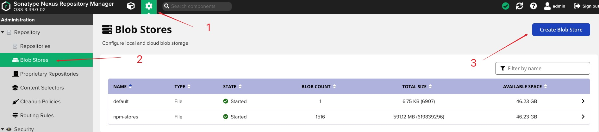
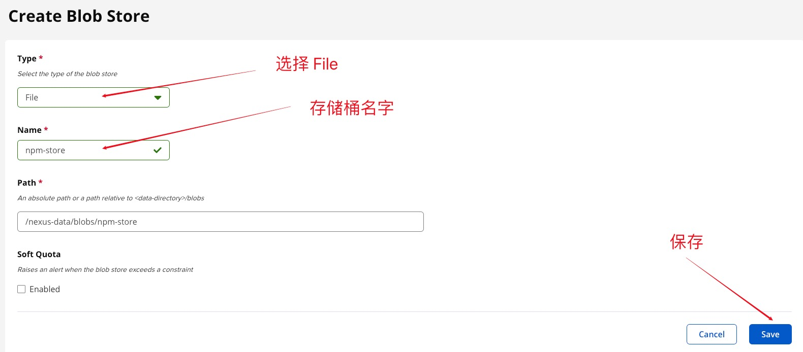
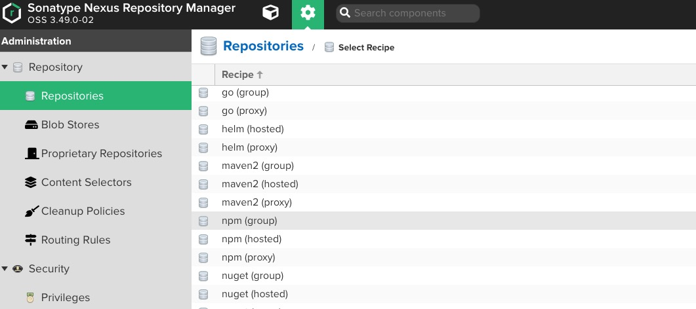
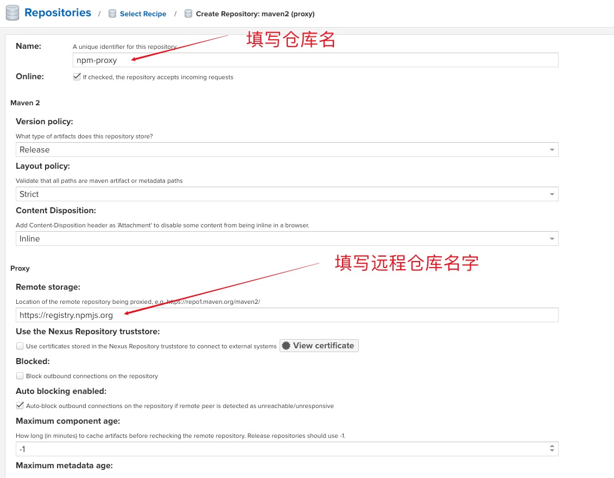
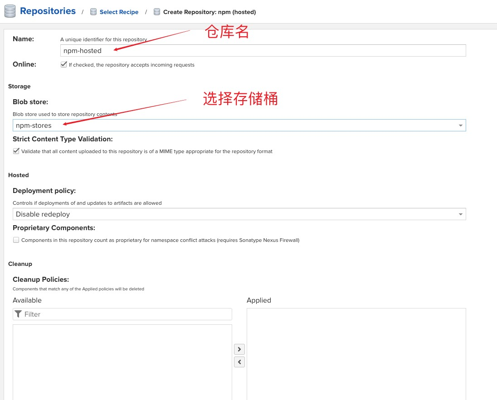
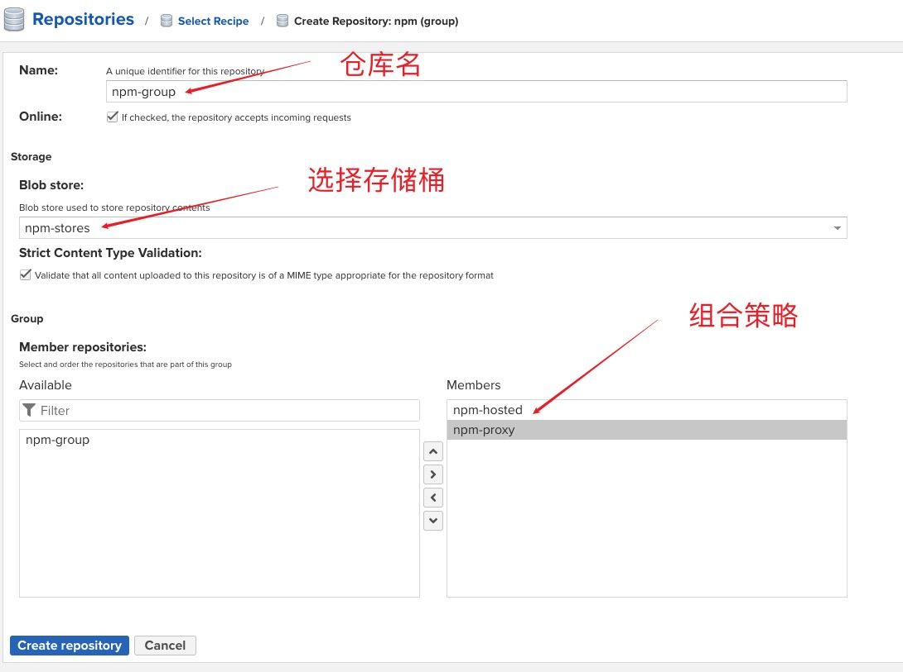

# Nexus 搭建 npm 私服

## 下载安装 Nexus

```bash
# 下载 docker 镜像
docker pull sonatype/nexus3

# 创建数据卷
docker volume create nexus-data

# 启动 nexus
docker run -d -p 6398:8081 --name jxrory-nexus -v nexus-data:/nexus-data sonatype/nexus3
```

访问 [http://localhost:6398](http://localhost:6398)

## 创建 Nexus 存储桶 (可选)





## Nexus 中配置 npm 仓库

点击添加仓库后, 找到对应的 `npm` 选项.



NOTICE: npm(group)表示分组，npm(hosted)表示本机私有，npm(proxy)表示远程代理。

### 创建远程代理仓库 `npm(proxy)`

一般代理到 npm 官网库([http://registry.cnpmjs.org/](http://registry.cnpmjs.org/)), 或者官网镜像库(如淘宝镜像库: [https://registry.npm.taobao.org](https://registry.npm.taobao.org))



### 创建私有仓库 `npm(hosted)`

用于存放自己的私有包



### 创建组合仓 `npm(group)`

用于配置找包的策略, 如: 当 `私有仓库` 未找到对应的包时, 会去 `远程代理仓库` 寻找.



## 客户端的 npm 配置

### 设置 npm 默认仓库地址

```bash
# 查看当前仓库配置
npm config get registry  # http://registry.cnpmjs.org/

# 将 npm 仓库配置修改至 nexus 仓库上
npm config set registry http://localhost:6398/repository/npm-group/
```

### `.npmrc` 配置

```conf
registry=http://127.0.0.1:6398/repository/npm-group/
// 设置邮箱
email=jxrory@jxrory.com
// 开启 auth 验证
always-auth=true
// _auth是 username:password 的base64值
_auth="ZGVwbG95ZXI6ZGVwbG95ZXI="
```

### 发布到私有仓库

**NOTICE: 发布是 `npm-hosted`，不是 npm-group.**

有两种方式, 任选其一:

**1. 项目级别**:

在 `package.json` 中配置

```json
{
  "publishConfig": {
    "registry": "http://localhost:6398/repository/npm-hosted/"
  }
}
```

在项目根目录执行 `npm publish` 即可.

**2. 命令行级别**:

```bash
# 发布时指定仓库
npm publish --registry=http://localhost:6398/repository/npm-hosted/
```

## 参考

- [博客园-使用 Nexus3 Repository Manager 搭建 npm 私服](https://www.cnblogs.com/cangqinglang/p/11284883.html)
