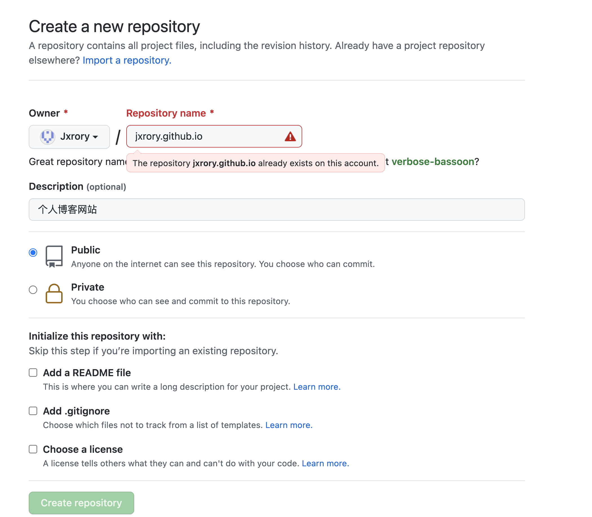

# github io 使用

## 创建仓库

在github上创建一个仓库, **仓库的名字 `{username}`.github.io**, `{username}`需要替换成自己的用户名.



!> 注意: 将 `{username}` 换成自己的用户名, 我的github.io 仓库已经存在, 所以无法创建!!

## 克隆仓库

```bash
git clone https://github.com/{username}/{username}.github.io
```

!> 替换 `{username}` 为自己的用户名.

## Hello World

```bash
cd username.github.io

echo "Hello World" > index.html
```

## 推送

```bash
git add --all

git commit -m "Initial commit"

git push -u origin main
```

## 验证

访问: https://{username}.github.io

!> 替换 `{username}` 为自己的用户名.

**想让自己的页面更加好看?**

[docsify 使用](/OpsDev/docsify.md)

## 参考

[github.io](github.io)
