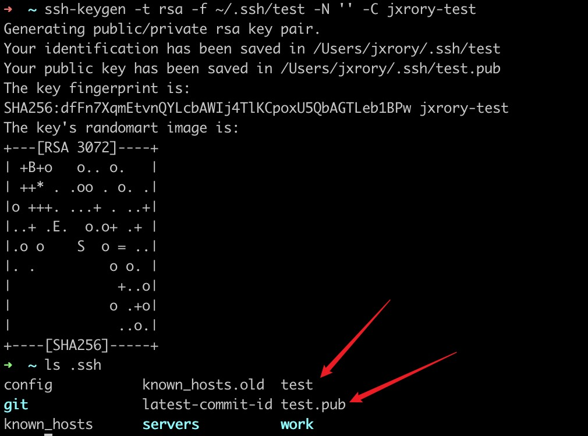

# SSH 秘钥登录服务器配置

## 客户端创建 SSH 公钥和私钥

```bash
ssh-keygen -t rsa -f ~/.ssh/test -N '' -C jxrory-test
```

```text
-t: 密钥类型, 可以选择 dsa | ecdsa | ed25519 | rsa; 省略的情况下默认是rsa

-f: 密钥目录位置,指定生成密钥的保存路径和文件名。省略的情况下， 默认为当前用户home路径下的.ssh隐藏目录, 也就是~/.ssh/, 同时默认密钥文件名以id_rsa开头. 　　-f省略的情况下，默认目录就是~/.ssh/，不会再次提醒输入。但是会再次提是你输入文件名，如果不输入直接回车，则默认的密钥文件名就是id_rsa
-C: 指定此密钥的备注信息, 需要配置多个免密登录时, 建议携带;生成的公钥会在最后面显示此备注信息

-N: 指定此密钥对的密码, 如果指定此参数, 则命令执行过程中就不会出现交互确认密码的信息了.如果省略此参数，会提示你输入密码和密码确认。一般情况下不用输入，直接回车就行。 　　如果输入密码之后，以后每次都要输入密码。这里请根据你的安全需要决定是否需要密码，如果不需要，直接回车:
```



## 在服务器端配置公钥

NOTCE: 需要在服务器上操作

复制 `test.pub` 里的公钥到服务器端的 `authorized_keys` 文件中

```bash
# 将 test.pub 中的内容追加到服务器的 ~/.ssh/authorized_keys
vi ~/.ssh/authorized_keys
```

## 客户端设置

在客户端 `~/.ssh` 目录下的配置文件 `config` 中加入如下内容。

```conf
Host jxrory-server
    HostName <远程主机IP地址>
    Port 22
    User root
    Identityfile ~/.ssh/test
```

[`config`详细配置](./ssh-config.md)

登录服务器命令

```bash
ssh jxrory-server
```

参考:

- [https://bolerolily.github.io/2018/08/02/搭建 Git 服务器/](https://bolerolily.github.io/2018/08/02/%E6%90%AD%E5%BB%BAGit%E6%9C%8D%E5%8A%A1%E5%99%A8/)
