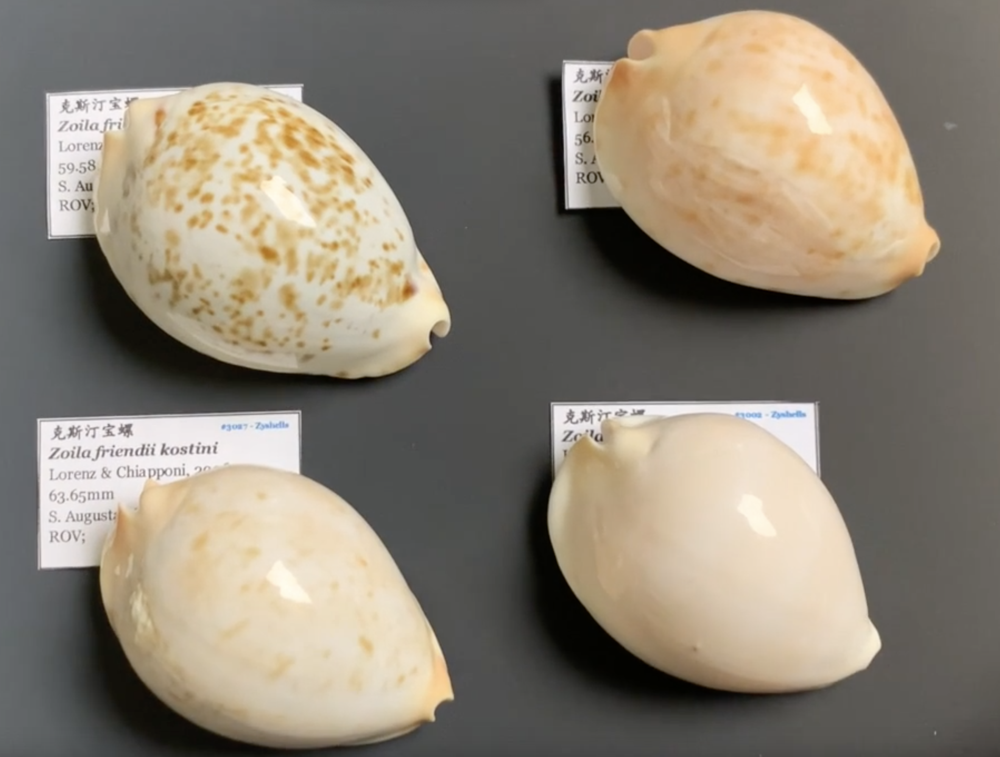
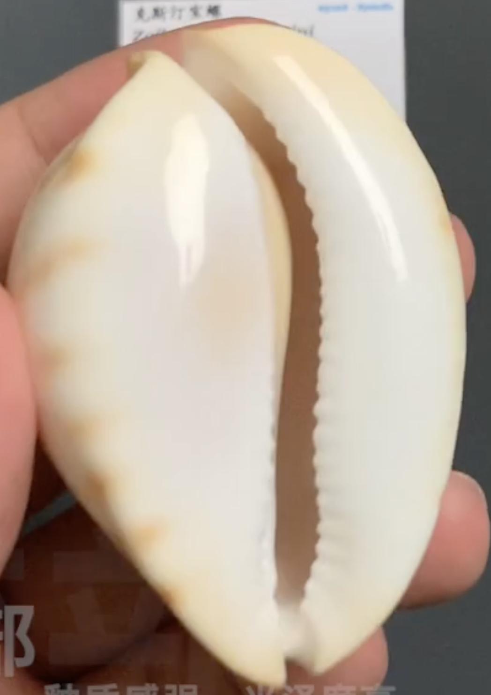

# 克斯汀宝螺

英文: zoila friendii kostini

## 辨识

**体型**:

椭圆, 鹅卵石型.

**背部**:

分布有斑点, 极少无斑(全白).

**底部**:

瓷白色, 釉质感强, 光泽度高, 两侧向水管凹陷.

**整体**:

不膨胀, 侧面看相对扁平.

**边缘**:

中小型圆点, 一般呈现金色.

## 参考

[Bilibili 视频](https://www.bilibili.com/video/BV1UE411k7ka/)
