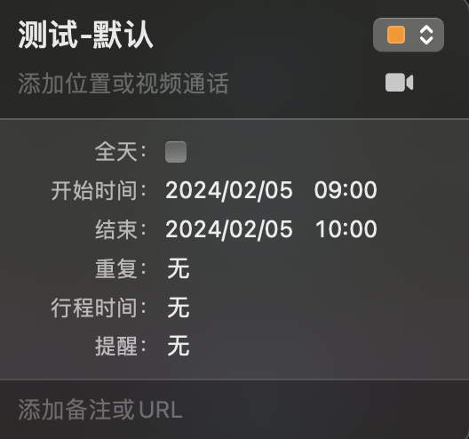
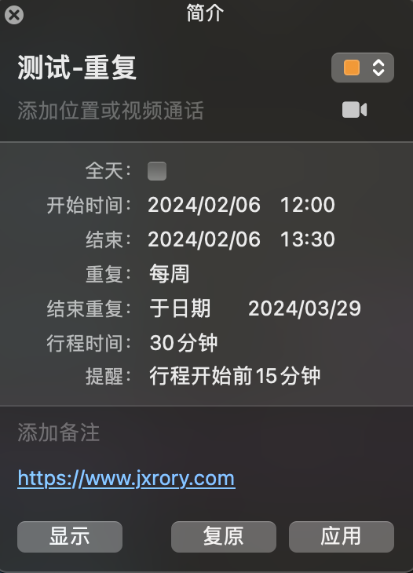
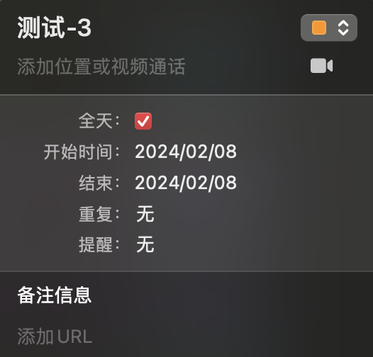
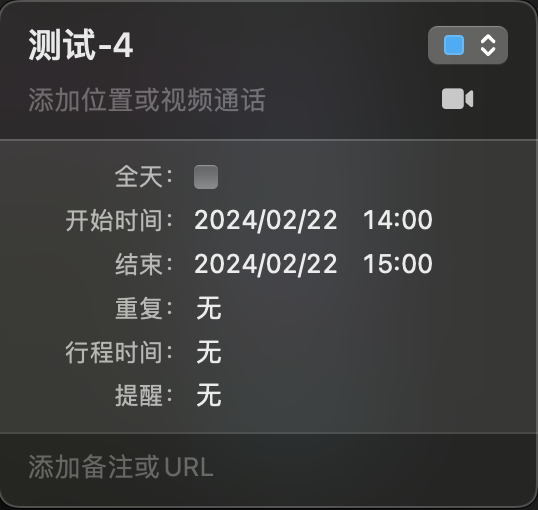
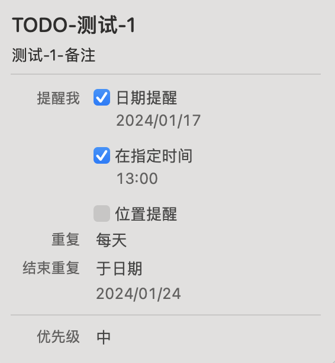

# Mac 日历数据结构

## 日历

Internet 日历和调度核心对象规范 (iCalendar) 是用于交换和部署日历事件和调度的 Internet 标准 (`RFC 2445`).

参考: [https://docs.fileformat.com/zh/email/ics/](https://docs.fileformat.com/zh/email/ics/)

`VCALENDAR` 是封装所有其他部分的全局部分。 `VEVENT` 部分定义事件，`VTODO` 列出所有待办事项，`VJOURNAL` 包含日记条目，`VTIMEZONE` 指定时区信息。

personID: `71138d9b-df41-4360-bf71-7aed61107d65`

### 日历 - 默认数据



文件: `1319679B-CC68-4BB8-A746-EFCC66CC066A.ics`

```ics
BEGIN:VCALENDAR
VERSION:2.0
CALSCALE:GREGORIAN
PRODID:-//Apple Inc.//macOS 14.1.1//EN
BEGIN:VTIMEZONE
TZID:Asia/Shanghai
BEGIN:STANDARD
DTSTART:19890917T020000
RRULE:FREQ=YEARLY;UNTIL=19910914T170000Z;BYMONTH=9;BYDAY=3SU
TZNAME:GMT+8
TZOFFSETFROM:+0900
TZOFFSETTO:+0800
END:STANDARD
BEGIN:DAYLIGHT
DTSTART:19910414T020000
RDATE:19910414T020000
TZNAME:GMT+8
TZOFFSETFROM:+0800
TZOFFSETTO:+0900
END:DAYLIGHT
END:VTIMEZONE
BEGIN:VEVENT
UID:1319679B-CC68-4BB8-A746-EFCC66CC066A
DTSTART;TZID=Asia/Shanghai:20240205T090000
DTEND;TZID=Asia/Shanghai:20240205T100000
CREATED:20240114T123807Z
DTSTAMP:20240114T123807Z
LAST-MODIFIED:20240114T123807Z
SEQUENCE:0
SUMMARY:测试-默认
TRANSP:OPAQUE
X-APPLE-CREATOR-IDENTITY:com.apple.calendar
X-APPLE-CREATOR-TEAM-IDENTITY:0000000000
END:VEVENT
END:VCALENDAR
```

### 日历 - 重复



文件: `069CCA65-8C23-4C4E-B531-1639BE3D1584.ics`

```ics
BEGIN:VCALENDAR
VERSION:2.0
CALSCALE:GREGORIAN
PRODID:-//Apple Inc.//macOS 14.1.1//EN
BEGIN:VEVENT
# UID
UID:069CCA65-8C23-4C4E-B531-1639BE3D1584
# 开始时间
DTSTART;VALUE=DATE:20240206
DTEND;VALUE=DATE:20240207
# 创建时间
CREATED:20240114T125638Z
DTSTAMP:20240114T125642Z
# 更新时间
LAST-MODIFIED:20240114T125638Z
# 重复规则, 频率(FREQ): 周; 结束时间(UNTIL): 20240328
RRULE:FREQ=WEEKLY;UNTIL=20240328
# 序列
SEQUENCE:0
# 内容
SUMMARY:测试-重复
# 透明: 不透明
TRANSP:OPAQUE
# 添加 URL
URL;VALUE=URI:https://www.jxrory.com
## 提醒设置 `VALARM`
BEGIN:VALARM
ACTION:DISPLAY
DESCRIPTION:提醒事项
TRIGGER:PT9H
UID:5FEC5A51-8E90-4EBE-8051-EDD1AF89659C
X-WR-ALARMUID:5FEC5A51-8E90-4EBE-8051-EDD1AF89659C
END:VALARM
X-APPLE-CREATOR-IDENTITY:com.apple.calendar
X-APPLE-CREATOR-TEAM-IDENTITY:0000000000
END:VEVENT
END:VCALENDAR
```

### 日历 - 3



文件: `50426D79-6795-418F-A420-C9CC77ADFDF8.ics`

```ics
BEGIN:VCALENDAR
VERSION:2.0
CALSCALE:GREGORIAN
PRODID:-//Apple Inc.//macOS 14.1.1//EN
BEGIN:VEVENT
UID:50426D79-6795-418F-A420-C9CC77ADFDF8
DTSTART;VALUE=DATE:20240208
DTEND;VALUE=DATE:20240209
CREATED:20240114T131916Z
# 备注
DESCRIPTION:备注信息
DTSTAMP:20240114T131932Z
LAST-MODIFIED:20240114T131916Z
SEQUENCE:0
SUMMARY:测试-3
TRANSP:OPAQUE
BEGIN:VALARM
ACTION:NONE
TRIGGER;VALUE=DATE-TIME:19760401T005545Z
END:VALARM
X-APPLE-CREATOR-IDENTITY:com.apple.calendar
X-APPLE-CREATOR-TEAM-IDENTITY:0000000000
END:VEVENT
END:VCALENDAR
```

### 日历 - 4



文件: `63400EB2-8C75-4FA2-A61F-7B0159BB7F67.ics`

```ics
BEGIN:VCALENDAR
VERSION:2.0
CALSCALE:GREGORIAN
PRODID:-//Apple Inc.//macOS 14.1.1//EN
# BEGIN:VTIMEZONE
# TZID:Asia/Shanghai
# BEGIN:STANDARD
# DTSTART:19890917T020000
# RRULE:FREQ=YEARLY;UNTIL=19910914T170000Z;BYMONTH=9;BYDAY=3SU
# TZNAME:GMT+8
# TZOFFSETFROM:+0900
# TZOFFSETTO:+0800
# END:STANDARD
# BEGIN:DAYLIGHT
# DTSTART:19910414T020000
# RDATE:19910414T020000
# TZNAME:GMT+8
# TZOFFSETFROM:+0800
# TZOFFSETTO:+0900
# END:DAYLIGHT
# END:VTIMEZONE
BEGIN:VEVENT
UID:63400EB2-8C75-4FA2-A61F-7B0159BB7F67
DTSTART;TZID=Asia/Shanghai:20240222T140000
DTEND;TZID=Asia/Shanghai:20240222T150000
CREATED:20240114T132552Z
DTSTAMP:20240114T132721Z
LAST-MODIFIED:20240114T132720Z
SEQUENCE:0
SUMMARY:测试-4
TRANSP:OPAQUE
X-APPLE-CREATOR-IDENTITY:com.apple.calendar
X-APPLE-CREATOR-TEAM-IDENTITY:0000000000
END:VEVENT
END:VCALENDAR
```

### 手动添加数据

直接在服务器上添加 `ics` 文件, 命令如下:

```shell
tee <<EOF > 63400EB2-8C75-4FA2-A61F-7B01594A7F67.ics
BEGIN:VCALENDAR
VERSION:2.0
CALSCALE:GREGORIAN
BEGIN:VEVENT
UID:63400EB2-8C75-4FA2-A61F-7B01594A7F67
DTSTART:20240223T100000Z
DTEND:20240223T140000Z
CREATED:20240114T132552Z
DTSTAMP:20240114T132721Z
LAST-MODIFIED:20240114T132720Z
SEQUENCE:0
SUMMARY:测试-手动后台添加数据
TRANSP:OPAQUE
END:VEVENT
END:VCALENDAR
EOF
```

可正常显示

## TODO



文件: `BEE6982B-C9C2-440C-96C4-8071D4D95AE0.ics`

```ics
BEGIN:VCALENDAR
VERSION:2.0
CALSCALE:GREGORIAN
PRODID:-//Apple Inc.//iOS 14.1.1//EN

BEGIN:VTODO
CREATED:20240115T031952Z
DESCRIPTION:测试-1-备注
DTSTAMP:20240115T032131Z
# 开始执行时间
DTSTART;TZID=Asia/Shanghai:20240117T130000
# 截止到期时间
DUE;TZID=Asia/Shanghai:20240117T130000
LAST-MODIFIED:20240115T032129Z
PRIORITY:5
RRULE:FREQ=DAILY;UNTIL=20240124T050000Z
STATUS:NEEDS-ACTION
SUMMARY:TODO-测试-1
UID:BEE6982B-C9C2-440C-96C4-8071D4D95AE0

## VALARM
BEGIN:VALARM
ACTION:DISPLAY
DESCRIPTION:Reminder
TRIGGER;VALUE=DATE-TIME:20240117T050000Z
UID:EC27CA3D-1A94-4E7E-B57E-C2BBFE775C3E
X-WR-ALARMUID:EC27CA3D-1A94-4E7E-B57E-C2BBFE775C3E
END:VALARM

END:VTODO

END:VCALENDAR
```
