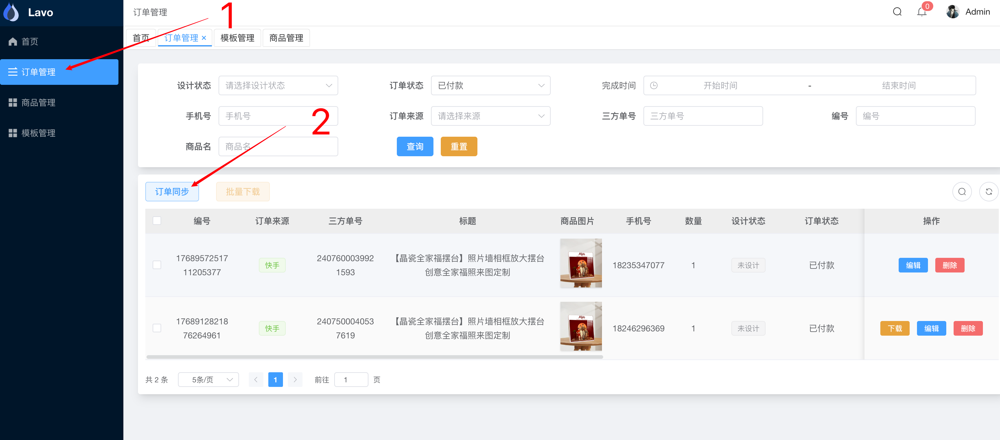

# 爱念居家 - 后台操作手册

## 添加设计模板

填写模板名称并上传模板

> NOTICE: 名称会用在商品关联模板时进行搜索, 尽量填写
> 注意: 模板请使用 PNG 格式, 目前是模板覆盖用户图片的做法, 需要模板有透明的情况;

## 同步商品信息

> 注意: 同步完成商品信息后, 需要手动去关联对应的模板信息.

### 关联模板

## 订单同步

订单每过一个小时会自动同步最新订单, 也可以手动进行同步;

> 注意: `快手`目前存在 `单日解密额度` 一天仅能解密 20 条手机号; 如果用户无法通过手机号查找到对应的订单, 可以使用三方订单号进行查询
> [https://edu.kwaixiaodian.com/bbs/web/article?id=16556&layoutType=4](https://edu.kwaixiaodian.com/bbs/web/article?id=16556&layoutType=4)

### 【特殊情况】订单未关联模板 - 手动关联

商品已关联模板, 订单会自动关联到对应的模板信息, 无需做过多的操作;

如果存在个别未关联模板的情况可以手动进行关联模板信息;

### 订单重新设计与提交

将设计状态重置为 `未设计`, `订单编辑页面` -> `设计状态`

